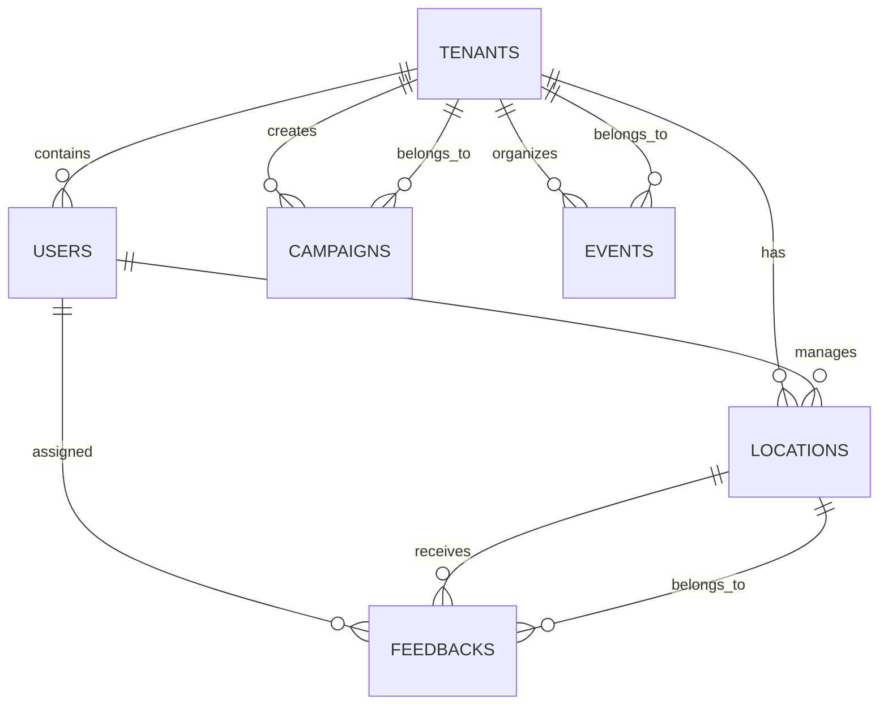
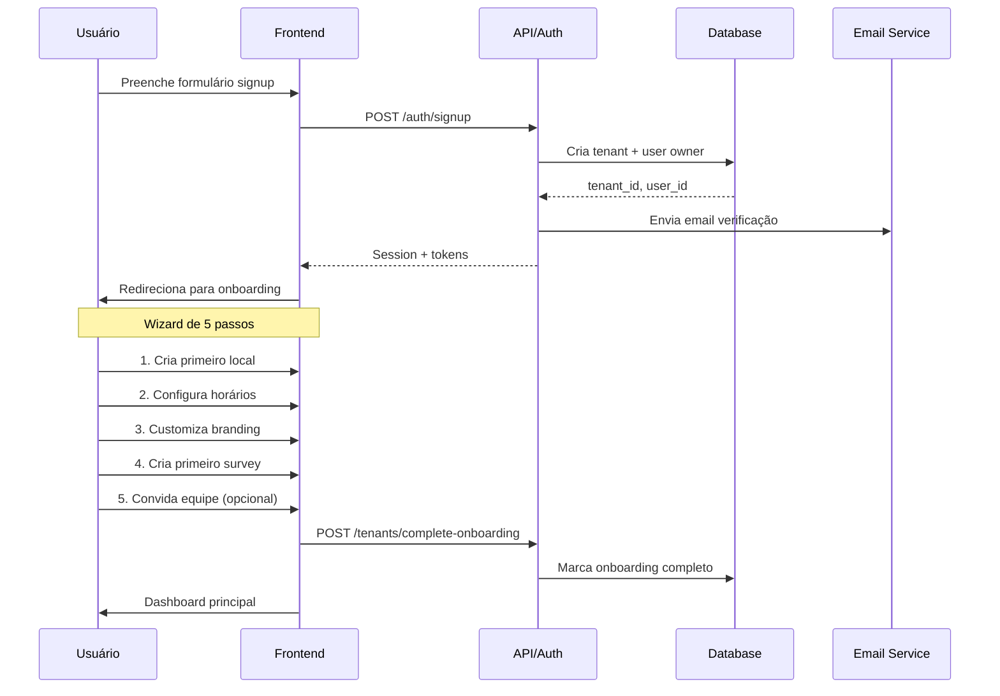
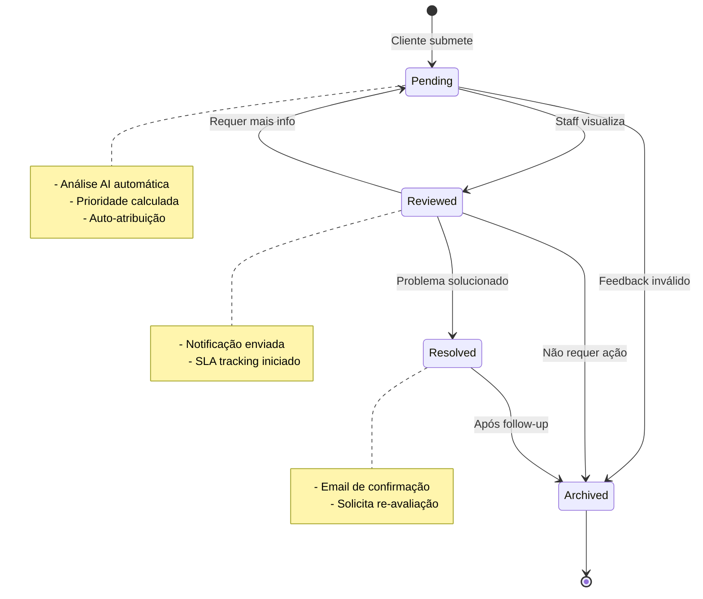

# InteliFeed Hub - Guia Executivo de Implementação

> **Plataforma SaaS Multi-Tenant para Gestão de Feedback de Restaurantes**  
> **Status:** Production-Ready | **Arquitetura:** Mobile-First PWA | **Backend:** Supabase + PostgreSQL

---

## 🎯 EXECUTIVE SUMMARY

O **InteliFeed Hub** é uma plataforma completa que revoluciona a gestão de feedback em restaurantes através de 4 pilares tecnológicos:

1.  **AI-First**: Análise automática de sentimentos e insights preditivos
2.  **Omnichannel**: Comunicação unificada em 5 canais (Email, SMS, WhatsApp, Push, In-App)
3.  **Event-Driven**: Gamificação para aumentar engajamento de clientes
4.  **Zero-Code**: Interface visual para criação de campanhas sem programação

**Modelo de Receita:** SaaS por assinatura (R$ 97 a R$ 597/mês + Enterprise Custom)

---

## 📊 BUSINESS MODEL CANVAS

### Segmentos de Clientes
- **Principal**: Redes de restaurantes (3+ unidades)
- **Secundário**: Restaurantes independentes premium
- **Terciário**: Food courts e praças de alimentação

### Proposta de Valor
```
┌─────────────────────────────────────────────────────────┐
│ PROBLEMA                 │ SOLUÇÃO INTELIFEED           │
├─────────────────────────────────────────────────────────┤
│ Feedback fragmentado     │ Centralização omnichannel    │
│ Análise manual demorada  │ AI automática em tempo real  │
│ Baixo engajamento        │ Gamificação com recompensas  │
│ Resposta lenta           │ Alertas e priorização auto   │
│ Falta de insights        │ Dashboards preditivos        │
└─────────────────────────────────────────────────────────┘
```

### Estrutura de Receita

| Plano | Preço/Mês | Locais | Feedbacks/Mês | Margem Estimada |
|---|---|---|---|---|
| **Starter** | R$ 97 | 1 | 500 | 75% |
| **Professional** | R$ 297 | 5 | 2.500 | 80% |
| **Enterprise** | R$ 597 | ∞ | ∞ | 85% |
| **Enterprise+** | Custom | ∞ | ∞ | 90% |

**LTV Projetado (24 meses):**
- Starter: R$ 2.328
- Professional: R$ 7.128
- Enterprise: R$ 14.328

**CAC Target:** < R$ 500 (Payback < 6 meses)

---

## 🏗️ ARQUITETURA DO SISTEMA

### Visão Geral
```
┌─────────────────────────────────────────────────────────────┐
│                    FRONTEND (React + TypeScript)            │
│  ┌──────────────┬──────────────┬──────────────────────┐    │
│  │   Web App    │  Mobile PWA  │  Admin Dashboard     │    │
│  │  (Clientes)  │  (Gestores)  │  (Configuração)      │    │
│  └──────────────┴──────────────┴──────────────────────┘    │
└─────────────────────────────────────────────────────────────┘
                             ↕ HTTPS/WSS
┌─────────────────────────────────────────────────────────────┐
│                    SUPABASE (BaaS Layer)                    │
│  ┌──────────────┬──────────────┬──────────────────────┐    │
│  │  Auth + MFA  │  PostgreSQL  │  Realtime Channels   │    │
│  │  (JWT)       │  + RLS       │  (WebSockets)        │    │
│  └──────────────┴──────────────┴──────────────────────┘    │
│  ┌──────────────┬──────────────┬──────────────────────┐    │
│  │  Storage     │  Edge Funcs  │  Webhooks            │    │
│  │  (Assets)    │  (Serverless)│  (Notificações)      │    │
│  └──────────────┴──────────────┴──────────────────────┘    │
└─────────────────────────────────────────────────────────────┘
                             ↕ APIs
┌─────────────────────────────────────────────────────────────┐
│                    SERVIÇOS EXTERNOS                        │
│  ┌──────────────┬──────────────┬──────────────────────┐    │
│  │  OpenAI/     │  Twilio      │  SendGrid            │    │
│  │  Anthropic   │  (SMS/WA)    │  (Email)             │    │
│  │  (AI)        │              │                      │    │
│  └──────────────┴──────────────┴──────────────────────┘    │
│  ┌──────────────┬──────────────┬──────────────────────┐    │
│  │  Stripe      │  Sentry      │  Posthog             │    │
│  │  (Billing)   │  (Errors)    │  (Analytics)         │    │
│  └──────────────┴──────────────┴──────────────────────┘    │
└─────────────────────────────────────────────────────────────┘
```

### Decisões Arquiteturais Críticas

#### ✅ Multi-Tenant: Shared Schema + RLS
**Escolha:** Compartilhar schema com isolamento via Row Level Security

**Justificativa:**
- **Custo**: 90% mais econômico que schemas isolados
- **Manutenção**: Deploy único para todos os tenants
- **Performance**: Connection pooling eficiente
- **Segurança**: RLS testado e validado pelo Supabase

**Trade-off Aceito:**
- ❌ Menos flexibilidade para customizações por tenant
- ✅ Operação mais simples e escalável

#### ✅ Supabase como Backend
**Escolha:** BaaS (Backend-as-a-Service) ao invés de backend customizado

**Justificativa:**
- **Time-to-Market**: 70% mais rápido
- **Infraestrutura**: PostgreSQL, Auth, Realtime inclusos
- **Manutenção**: Patches e updates automáticos
- **Custo**: R$ 25/mês vs R$ 500+/mês de servidor

**Trade-off Aceito:**
- ❌ Vendor lock-in (mitigado por PostgreSQL padrão)
- ✅ Foco no core business ao invés de infraestrutura

---

## 🔐 MODELO DE PERMISSÕES

### Hierarquia de Roles
```
                    ┌─────────────┐
                    │    OWNER    │ ← Acesso Total
                    └──────┬──────┘
                           │
                    ┌──────▼──────┐
                    │    ADMIN    │ ← Sem Billing
                    └──────┬──────┘
                           │
                    ┌──────▼──────┐
                    │   MANAGER   │ ← Apenas seus locais
                    └──────┬──────┘
                           │
        ┌──────────────────┴──────────────────┐
        │                                     │
   ┌────▼─────┐                         ┌────▼────┐
   │  STAFF   │ ← Feedbacks atribuídos  │ VIEWER  │ ← Somente leitura
   └──────────┘                         └─────────┘
```

### Matriz de Permissões Simplificada

| Recurso | Owner | Admin | Manager | Staff | Viewer |
|---|---|---|---|---|---|
| **Billing** | ✅ | ❌ | ❌ | ❌ | ❌ |
| **Usuários** | ✅ | ✅ | ❌ | ❌ | ❌ |
| **Locais** | ✅ | ✅ | ✅* | ❌ | ❌ |
| **Feedbacks** | ✅ | ✅ | ✅* | ✅** | 👁️ |
| **Campanhas** | ✅ | ✅ | ✅ | ❌ | 👁️ |
| **Eventos** | ✅ | ✅ | ✅ | ❌ | 👁️ |
| **Analytics** | ✅ | ✅ | ✅ | 👁️ | ✅ |

*Apenas locais que gerencia  
**Apenas feedbacks atribuídos a ele  
👁️ = Somente visualização

### Regras Especiais
```typescript
// Manager só vê feedbacks dos locais que gerencia
if (user.role === 'manager') {
  feedbacks = feedbacks.filter(f => 
    user.managed_locations.includes(f.location_id)
  );
}

// Staff só pode responder feedbacks atribuídos
if (user.role === 'staff') {
  canRespond = feedback.assigned_to === user.id;
}

// Viewer não vê dados pessoais
if (user.role === 'viewer') {
  customer_data = {
    name: "Cliente ***",
    email: "***@***.com",
    phone: null
  };
}
```

---

## 💾 MODELO DE DADOS CORE

### Diagrama de Relacionamentos


### Tabelas Críticas (Top 5)

#### 1. **tenants** (Organizações)
```sql
CREATE TABLE tenants (
  id UUID PRIMARY KEY,
  name VARCHAR(255) NOT NULL,
  subdomain VARCHAR(50) UNIQUE NOT NULL,
  plan_id VARCHAR(50) DEFAULT 'starter',
  subscription_status VARCHAR(20) DEFAULT 'trialing',
  
  -- Limites
  usage_limits JSONB NOT NULL,  -- Por plano
  current_usage JSONB DEFAULT '{}',  -- Uso atual
  
  -- Auditoria
  created_at TIMESTAMP DEFAULT NOW(),
  trial_ends_at TIMESTAMP,  -- 14 dias
  deleted_at TIMESTAMP  -- Soft delete
);
```

#### 2. **users** (Usuários)
```sql
CREATE TABLE users (
  id UUID PRIMARY KEY,
  tenant_id UUID REFERENCES tenants(id) ON DELETE CASCADE,
  auth_id UUID UNIQUE NOT NULL,  -- Supabase Auth
  
  -- Perfil
  email VARCHAR(255) UNIQUE NOT NULL,
  full_name VARCHAR(255) NOT NULL,
  role VARCHAR(20) DEFAULT 'viewer',
  
  -- Permissões
  permissions JSONB DEFAULT '[]',
  managed_locations UUID[] DEFAULT '{}',  -- Para managers
  
  -- Estado
  is_active BOOLEAN DEFAULT TRUE,
  last_login_at TIMESTAMP,
  created_at TIMESTAMP DEFAULT NOW()
);

-- RLS Policy
CREATE POLICY "users_tenant_isolation" ON users
  FOR ALL USING (tenant_id = auth.jwt() ->> 'tenant_id');
```

#### 3. **locations** (Restaurantes)
```sql
CREATE TABLE locations (
  id UUID PRIMARY KEY,
  tenant_id UUID REFERENCES tenants(id) ON DELETE CASCADE,
  
  -- Identificação
  name VARCHAR(255) NOT NULL,
  slug VARCHAR(255) NOT NULL,
  
  -- Endereço
  address JSONB NOT NULL,
  coordinates POINT,  -- Para geolocalização
  
  -- Gerenciamento
  manager_id UUID REFERENCES users(id) ON DELETE SET NULL,
  business_hours JSONB NOT NULL,
  
  -- Estado
  is_active BOOLEAN DEFAULT TRUE,
  created_at TIMESTAMP DEFAULT NOW(),
  
  CONSTRAINT unique_slug_per_tenant UNIQUE (tenant_id, slug)
);
```

#### 4. **feedbacks** (Avaliações)
```sql
CREATE TABLE feedbacks (
  id UUID PRIMARY KEY,
  location_id UUID REFERENCES locations(id) ON DELETE CASCADE,
  
  -- Cliente
  customer_data JSONB,
  customer_id UUID,  -- Se cadastrado
  
  -- Respostas
  responses JSONB NOT NULL,
  nps_score INTEGER CHECK (nps_score BETWEEN 0 AND 10),
  overall_rating DECIMAL(3,2) CHECK (overall_rating BETWEEN 0 AND 5),
  
  -- AI Analysis
  sentiment VARCHAR(20) CHECK (sentiment IN ('positive', 'neutral', 'negative')),
  sentiment_score DECIMAL(3,2),  -- -1.0 a 1.0
  keywords TEXT[],
  topics TEXT[],
  
  -- Gestão
  status VARCHAR(20) DEFAULT 'pending',
  priority VARCHAR(20) DEFAULT 'normal',
  assigned_to UUID REFERENCES users(id),
  
  -- Timestamps
  created_at TIMESTAMP DEFAULT NOW(),
  reviewed_at TIMESTAMP,
  resolved_at TIMESTAMP
);

-- Indexes críticos
CREATE INDEX idx_feedbacks_location_date 
  ON feedbacks(location_id, created_at DESC);
CREATE INDEX idx_feedbacks_status 
  ON feedbacks(status) WHERE status != 'archived';
CREATE INDEX idx_feedbacks_priority 
  ON feedbacks(priority) WHERE priority IN ('high', 'urgent');
```

#### 5. **campaigns** (Campanhas)
```sql
CREATE TABLE campaigns (
  id UUID PRIMARY KEY,
  tenant_id UUID REFERENCES tenants(id) ON DELETE CASCADE,
  
  -- Identificação
  name VARCHAR(255) NOT NULL,
  type VARCHAR(20) NOT NULL,  -- email, sms, whatsapp, push
  
  -- Conteúdo
  content JSONB NOT NULL,
  
  -- Público-alvo
  target_audience JSONB NOT NULL,
  estimated_reach INTEGER,
  
  -- Agendamento
  schedule JSONB,
  send_at TIMESTAMP,
  
  -- Estado
  status VARCHAR(20) DEFAULT 'draft',
  
  -- Métricas (atualizadas em tempo real)
  metrics JSONB DEFAULT '{
    "sent": 0,
    "delivered": 0,
    "opened": 0,
    "clicked": 0,
    "converted": 0
  }',
  
  -- Auditoria
  created_by UUID REFERENCES users(id),
  created_at TIMESTAMP DEFAULT NOW(),
  sent_at TIMESTAMP,
  completed_at TIMESTAMP
);
```

---

## 🔄 FLUXOS DE TRABALHO CRÍTICOS

### Onboarding de Nova Organização


### Ciclo de Vida do Feedback


### Análise AI de Feedback
```typescript
async function analyzeFeedback(text: string): Promise<AIAnalysis> {
  // 1. Chamar serviço de AI (OpenAI/Anthropic)
  const aiResponse = await aiService.analyze({
    text: text,
    tasks: [
      'sentiment_analysis',  // Positivo/Neutro/Negativo
      'keyword_extraction',  // Palavras-chave principais
      'topic_classification', // Tópicos (comida, atendimento, ambiente)
      'urgency_detection'    // Detectar urgência
    ]
  });
  
  // 2. Calcular sentiment score (-1.0 a 1.0)
  const sentimentScore = aiResponse.sentiment.polarity;
  
  // 3. Classificar sentimento
  const sentiment = classifySentiment(sentimentScore);
  
  // 4. Calcular prioridade baseada em múltiplos fatores
  const priority = calculatePriority({
    nps_score: feedback.nps_score,
    sentiment: sentiment,
    keywords: aiResponse.keywords,
    urgency: aiResponse.urgency
  });
  
  return {
    sentiment,
    sentiment_score: sentimentScore,
    keywords: aiResponse.keywords,
    topics: aiResponse.topics,
    priority,
    ai_summary: aiResponse.summary
  };
}
```

---

## 📡 APIs E INTEGRAÇÕES

### Endpoints Essenciais
```typescript
// Login
POST /api/auth/login
Body: { email: string; password: string; }
Response: { access_token, refresh_token, user, tenant }
```

### Realtime Subscriptions
```typescript
// Subscrever novos feedbacks em tempo real
const subscription = supabase
  .channel('new-feedbacks')
  .on(
    'postgres_changes',
    {
      event: 'INSERT',
      schema: 'public',
      table: 'feedbacks',
      filter: `location_id=eq.${locationId}`
    },
    (payload) => {
      // Novo feedback recebido!
      const feedback = payload.new;
    }
  )
  .subscribe();
```

### Webhooks Configuráveis
```typescript
// Configurar webhook no tenant
POST /api/webhooks
Body: {
  url: "https://meusite.com/webhooks/intelifeed",
  events: [
    "feedback.created",
    "feedback.urgent",
  ],
  secret: "seu-secret-para-validacao"
}
```

---

## 🔒 SEGURANÇA E COMPLIANCE

### Checklist de Segurança
- [x] JWT com expiração de 1 hora
- [x] RLS em todas as tabelas
- [x] TLS 1.3 obrigatório

### Políticas de Senha
```typescript
const PASSWORD_REQUIREMENTS = {
  minLength: 12,
  requireUppercase: true,
  requireLowercase: true,
  requireNumbers: true,
  requireSpecialChars: true,
};
```

### Audit Log
```typescript
// Todas as ações críticas são registradas
interface AuditLog {
  id: string;
  tenant_id: string;
  user_id: string;
  action: string;
  resource_type: string;
  resource_id: string;
  ip_address: string;
  created_at: string;
}
```

---

## 📈 MÉTRICAS E KPIs

### Product Metrics
```typescript
interface ProductKPIs {
  dau: number; // Daily Active Users
  mau: number; // Monthly Active Users
  stickiness: number; // DAU/MAU ratio
}
```

### Business Metrics
```typescript
interface BusinessKPIs {
  mrr: number; // Monthly Recurring Revenue
  arr: number; // Annual Recurring Revenue
  churn_mrr: number; // Cancelamentos
}
```

### Dashboards Essenciais
#### 1. **CEO Dashboard**
- MRR e crescimento mensal
- Churn rate
- NPS do produto

#### 2. **CTO Dashboard**
- Uptime e latência
- Error rate
- Database performance

#### 3. **CSM Dashboard**
- Health score por cliente
- Feature adoption
- Renewal risk

---

## 🚀 ROADMAP DE IMPLEMENTAÇÃO

### Fase 1: MVP (3 meses)
**Mês 1: Core Backend**
- [ ] Setup Supabase project
- [ ] Criar schema do banco
- [ ] Implementar RLS policies

**Mês 2: Frontend Essencial**
- [ ] Setup React + TypeScript
- [ ] Autenticação e onboarding
- [ ] Dashboard de feedbacks

**Mês 3: AI e Launch**
- [ ] Integração OpenAI/Anthropic
- [ ] Análise de sentimento
- [ ] Deploy produção

### Fase 2: Growth Features (3 meses)
**Mês 4: Campanhas**
- [ ] Builder de campanhas
- [ ] Integração email (SendGrid)

**Mês 5: Gamificação**
- [ ] Sistema de eventos
- [ ] Engine de recompensas

**Mês 6: Analytics Avançado**
- [ ] Dashboards preditivos
- [ ] Exportação de relatórios

### Fase 3: Enterprise (3 meses)
**Mês 7-9:**
- [ ] WhatsApp Business integration
- [ ] SSO/SAML
- [ ] Webhooks avançados