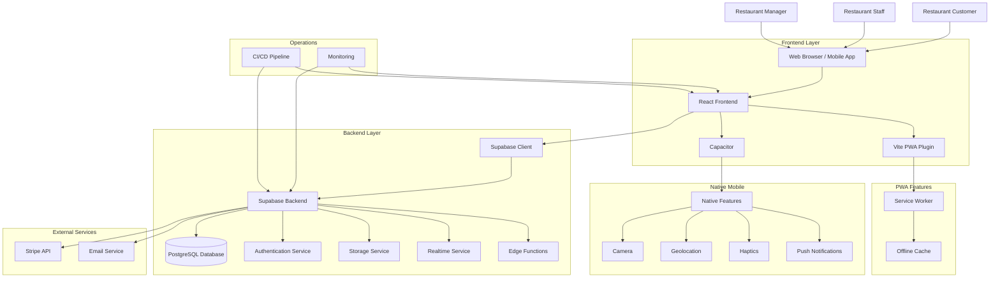

# InteliFeed Hub - System Architecture Diagram

This diagram shows the high-level architecture of the InteliFeed Hub platform, illustrating the relationships between different components and services.