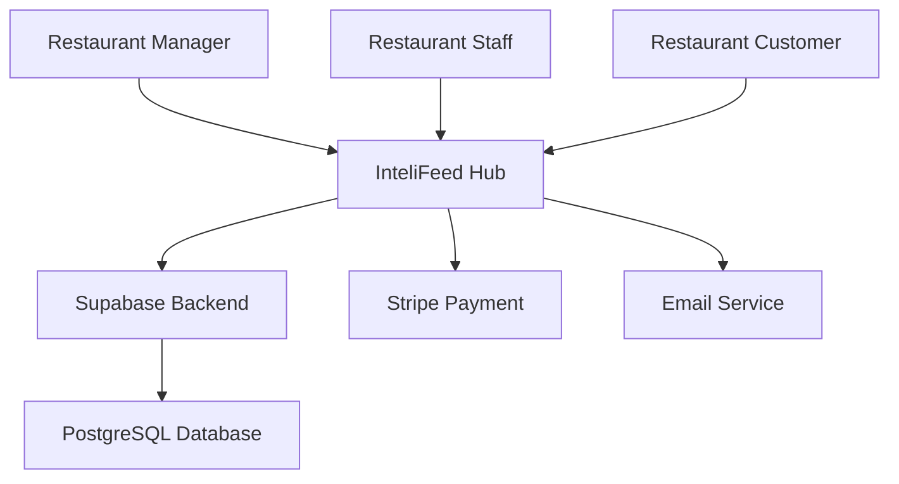
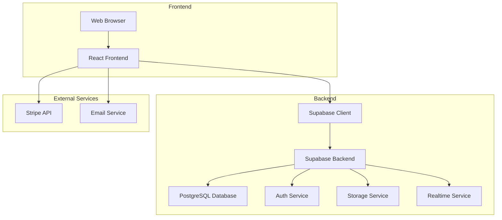
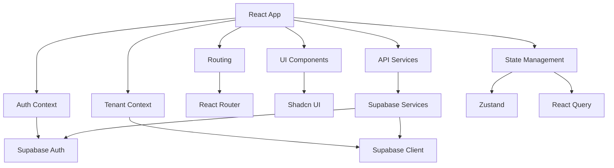
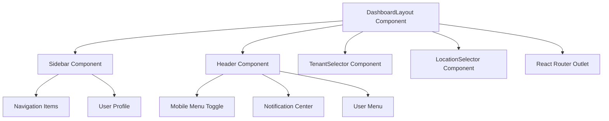
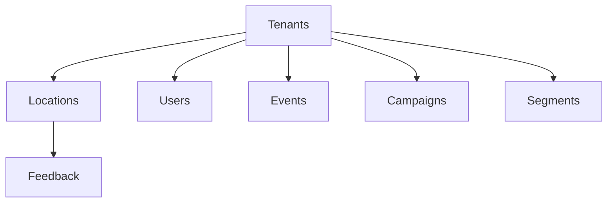

# C4 Model Architecture Diagrams

The C4 model is a hierarchical way to describe software architecture, where each level provides a different perspective on the system.

## Level 1: System Context Diagram



## Level 2: Container Diagram



## Level 3: Component Diagram



## Level 4: Code Diagram (Example Component)



## Key Architecture Patterns

### Multi-Tenant Architecture

The platform implements a single database, single schema multi-tenant architecture with row-level security (RLS) for data isolation:



### Data Flow Patterns

1. **Feedback Collection Flow**:
   ```mermaid
   graph LR
       A[Customer] --> B[Feedback Form]
       B --> C[Supabase Client]
       C --> D[Database]
       D --> E[Realtime Updates]
       E --> F[Dashboard]
   ```

2. **Analytics Processing Flow**:
   ```mermaid
   graph LR
       A[Feedback Data] --> B[Materialized Views]
       B --> C[Analytics Dashboard]
       A --> D[AI Insights Engine]
       D --> E[Insights Panel]
   ```

### Security Patterns

1. **Authentication Flow**:
   ```mermaid
   graph LR
       A[User] --> B[Login Form]
       B --> C[Supabase Auth]
       C --> D[JWT Token]
       D --> E[Protected Routes]
       E --> F[RLS Policies]
   ```

2. **Authorization Flow**:
   ```mermaid
   graph LR
       A[User Request] --> B[Auth Context]
       B --> C[Role Check]
       C --> D[Permission Check]
       D --> E[RLS Policy]
       E --> F[Database Access]
   ```