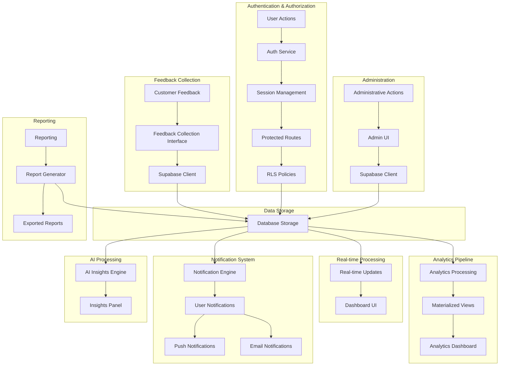

# InteliFeed Hub - Data Flow Diagram

This diagram illustrates the main data flows within the InteliFeed Hub platform, showing how customer feedback moves through the system and how various components interact with the database.