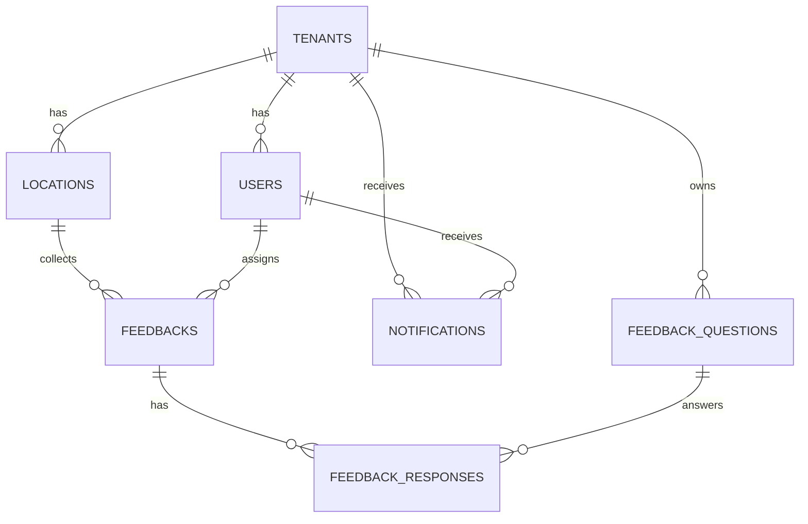

# Database Schema

The InteliFeed Hub platform uses a PostgreSQL database hosted on Supabase with a multi-tenant architecture. The schema is designed to efficiently store and retrieve feedback data while maintaining strict data isolation between tenants.

## Core Tables

### Tenants
The tenants table represents organizations using the platform.

```sql
CREATE TABLE tenants (
    id UUID PRIMARY KEY DEFAULT uuid_generate_v4(),
    name VARCHAR(255) NOT NULL,
    subdomain VARCHAR(100) UNIQUE NOT NULL,
    settings JSONB DEFAULT '{}',
    plan_id plan_type DEFAULT 'starter',
    created_at TIMESTAMP WITH TIME ZONE DEFAULT NOW(),
    updated_at TIMESTAMP WITH TIME ZONE DEFAULT NOW(),
    
    -- Billing information
    stripe_customer_id VARCHAR(255),
    trial_ends_at TIMESTAMP WITH TIME ZONE,
    
    -- Branding (for white-label)
    branding JSONB DEFAULT '{}',
    
    -- Usage limits based on plan
    monthly_feedback_limit INTEGER DEFAULT 500,
    location_limit INTEGER DEFAULT 1,
    
    CONSTRAINT valid_subdomain CHECK (subdomain ~ '^[a-z0-9-]+$')
);
```

### Users
The users table stores user information with role-based access control.

```sql
CREATE TABLE users (
    id UUID PRIMARY KEY DEFAULT uuid_generate_v4(),
    tenant_id UUID NOT NULL REFERENCES tenants(id) ON DELETE CASCADE,
    email VARCHAR(255) UNIQUE NOT NULL,
    role user_role DEFAULT 'viewer',
    permissions JSONB DEFAULT '{}',
    profile_data JSONB DEFAULT '{}',
    created_at TIMESTAMP WITH TIME ZONE DEFAULT NOW(),
    updated_at TIMESTAMP WITH TIME ZONE DEFAULT NOW(),
    last_login_at TIMESTAMP WITH TIME ZONE,
    
    -- Additional user info
    first_name VARCHAR(100),
    last_name VARCHAR(100),
    phone VARCHAR(20),
    avatar_url TEXT,
    
    -- User preferences
    preferences JSONB DEFAULT '{}',
    
    -- Status
    is_active BOOLEAN DEFAULT true,
    email_verified BOOLEAN DEFAULT false
);
```

### Locations
The locations table represents physical restaurant locations.

```sql
CREATE TABLE locations (
    id UUID PRIMARY KEY DEFAULT uuid_generate_v4(),
    tenant_id UUID NOT NULL REFERENCES tenants(id) ON DELETE CASCADE,
    name VARCHAR(255) NOT NULL,
    address TEXT,
    settings JSONB DEFAULT '{}',
    manager_id UUID REFERENCES users(id),
    created_at TIMESTAMP WITH TIME ZONE DEFAULT NOW(),
    updated_at TIMESTAMP WITH TIME ZONE DEFAULT NOW(),
    
    -- Location details
    phone VARCHAR(20),
    email VARCHAR(255),
    website TEXT,
    
    -- Geographic data
    latitude DECIMAL(10, 8),
    longitude DECIMAL(11, 8),
    timezone VARCHAR(50) DEFAULT 'America/Sao_Paulo',
    
    -- Business hours
    business_hours JSONB DEFAULT '{}',
    
    -- Status
    is_active BOOLEAN DEFAULT true
);
```

### Feedbacks
The feedbacks table stores customer feedback data.

```sql
CREATE TABLE feedbacks (
    id UUID PRIMARY KEY DEFAULT uuid_generate_v4(),
    location_id UUID NOT NULL REFERENCES locations(id) ON DELETE CASCADE,
    customer_data JSONB DEFAULT '{}',
    responses JSONB NOT NULL,
    sentiment feedback_sentiment,
    nps_score INTEGER CHECK (nps_score >= 0 AND nps_score <= 10),
    created_at TIMESTAMP WITH TIME ZONE DEFAULT NOW(),
    updated_at TIMESTAMP WITH TIME ZONE DEFAULT NOW(),
    
    -- Customer identification (optional)
    customer_email VARCHAR(255),
    customer_phone VARCHAR(20),
    customer_name VARCHAR(255),
    
    -- Feedback metadata
    source VARCHAR(50) DEFAULT 'web', -- web, qr, sms, email, whatsapp
    session_id VARCHAR(255),
    user_agent TEXT,
    ip_address INET,
    
    -- AI Analysis
    ai_insights JSONB DEFAULT '{}',
    keywords TEXT[],
    
    -- Status and follow-up
    status VARCHAR(50) DEFAULT 'new', -- new, reviewed, responded, resolved
    assigned_to UUID REFERENCES users(id),
    response_sent_at TIMESTAMP WITH TIME ZONE,
    
    -- Rating breakdown
    overall_rating DECIMAL(3,2),
    food_rating DECIMAL(3,2),
    service_rating DECIMAL(3,2),
    ambiance_rating DECIMAL(3,2),
    value_rating DECIMAL(3,2)
);
```

## Enhanced Schema Tables

### Notifications
The notifications table manages user notifications.

```sql
CREATE TABLE notifications (
    id UUID PRIMARY KEY DEFAULT uuid_generate_v4(),
    tenant_id UUID NOT NULL REFERENCES tenants(id) ON DELETE CASCADE,
    user_id UUID REFERENCES users(id) ON DELETE CASCADE,
    type VARCHAR(50) NOT NULL, -- 'feedback_received', 'campaign_sent', 'event_ended', etc.
    title VARCHAR(255) NOT NULL,
    message TEXT,
    data JSONB DEFAULT '{}',
    is_read BOOLEAN DEFAULT false,
    created_at TIMESTAMP WITH TIME ZONE DEFAULT NOW(),
    read_at TIMESTAMP WITH TIME ZONE
);
```

### Feedback Questions
The feedback_questions table normalizes feedback questions.

```sql
CREATE TABLE feedback_questions (
    id UUID PRIMARY KEY DEFAULT uuid_generate_v4(),
    tenant_id UUID NOT NULL REFERENCES tenants(id) ON DELETE CASCADE,
    question_text TEXT NOT NULL,
    question_type VARCHAR(50) NOT NULL, -- 'rating', 'text', 'boolean', 'multiple_choice'
    options JSONB, -- For multiple choice questions
    created_at TIMESTAMP WITH TIME ZONE DEFAULT NOW()
);
```

### Feedback Responses
The feedback_responses table stores normalized feedback responses.

```sql
CREATE TABLE feedback_responses (
    id UUID PRIMARY KEY DEFAULT uuid_generate_v4(),
    feedback_id UUID NOT NULL REFERENCES feedbacks(id) ON DELETE CASCADE,
    question_id UUID NOT NULL REFERENCES feedback_questions(id),
    response_value TEXT,
    response_numeric DECIMAL(10,2),
    created_at TIMESTAMP WITH TIME ZONE DEFAULT NOW(),
    
    UNIQUE(feedback_id, question_id)
);
```

## Enumerations

### User Roles
```sql
CREATE TYPE user_role AS ENUM ('owner', 'admin', 'manager', 'staff', 'viewer');
```

### Subscription Status
```sql
CREATE TYPE subscription_status AS ENUM ('active', 'canceled', 'past_due', 'unpaid', 'trialing');
```

### Plan Types
```sql
CREATE TYPE plan_type AS ENUM ('starter', 'professional', 'enterprise', 'enterprise_plus');
```

### Campaign Types
```sql
CREATE TYPE campaign_type AS ENUM ('email', 'sms', 'whatsapp', 'push', 'in_app');
```

### Event Types
```sql
CREATE TYPE event_type AS ENUM ('engagement_boost', 'recovery_campaign', 'lifecycle_celebration', 'flash_campaign', 'feedback_challenge');
```

### Feedback Sentiment
```sql
CREATE TYPE feedback_sentiment AS ENUM ('positive', 'neutral', 'negative');
```

## Indexes

### Performance Indexes
```sql
-- Add indexes for frequently queried JSON fields
CREATE INDEX IF NOT EXISTS idx_users_permissions ON users USING GIN (permissions);
CREATE INDEX IF NOT EXISTS idx_feedbacks_responses ON feedbacks USING GIN (responses);
CREATE INDEX IF NOT EXISTS idx_feedbacks_keywords ON feedbacks USING GIN (keywords);
CREATE INDEX IF NOT EXISTS idx_campaigns_metrics ON campaigns USING GIN (metrics);
CREATE INDEX IF NOT EXISTS idx_events_metrics ON events USING GIN (metrics);

-- Add composite indexes for common query patterns
CREATE INDEX IF NOT EXISTS idx_feedbacks_location_created ON feedbacks(location_id, created_at DESC);
CREATE INDEX IF NOT EXISTS idx_users_tenant_role ON users(tenant_id, role);
```

### Notification Indexes
```sql
CREATE INDEX IF NOT EXISTS idx_notifications_user_created ON notifications(user_id, created_at DESC);
CREATE INDEX IF NOT EXISTS idx_notifications_tenant_created ON notifications(tenant_id, created_at DESC);
```

## Materialized Views

### Daily Feedback Summary
```sql
CREATE MATERIALIZED VIEW IF NOT EXISTS daily_feedback_summary AS
SELECT 
    l.tenant_id,
    f.location_id,
    l.name as location_name,
    DATE(f.created_at) as feedback_date,
    COUNT(*) as total_feedbacks,
    AVG(f.overall_rating) as avg_rating,
    AVG(f.nps_score) as avg_nps,
    COUNT(CASE WHEN f.sentiment = 'positive' THEN 1 END) as positive_count,
    COUNT(CASE WHEN f.sentiment = 'neutral' THEN 1 END) as neutral_count,
    COUNT(CASE WHEN f.sentiment = 'negative' THEN 1 END) as negative_count
FROM feedbacks f
JOIN locations l ON f.location_id = l.id
GROUP BY l.tenant_id, f.location_id, l.name, DATE(f.created_at);
```

## Row Level Security (RLS) Policies

RLS policies ensure data isolation between tenants:

```sql
-- Enable RLS on all tables
ALTER TABLE tenants ENABLE ROW LEVEL SECURITY;
ALTER TABLE users ENABLE ROW LEVEL SECURITY;
ALTER TABLE locations ENABLE ROW LEVEL SECURITY;
ALTER TABLE feedbacks ENABLE ROW LEVEL SECURITY;

-- Users can view other users in their tenant
CREATE POLICY "Users can view users in their tenant" ON users
  FOR SELECT USING (
    tenant_id = get_current_tenant_id()
  );

-- Users can view locations in their tenant
CREATE POLICY "Users can view locations in their tenant" ON locations
  FOR SELECT USING (
    tenant_id = get_current_tenant_id()
  );

-- Users can view feedbacks for locations in their tenant
CREATE POLICY "Users can view feedbacks in their tenant" ON feedbacks
  FOR SELECT USING (
    EXISTS (
      SELECT 1 FROM locations l 
      WHERE l.id = feedbacks.location_id 
      AND l.tenant_id = get_current_tenant_id()
    )
  );
```

## Functions

### Tenant Usage Statistics
```sql
CREATE OR REPLACE FUNCTION get_tenant_usage(tenant_uuid UUID)
RETURNS TABLE(
    feedback_count BIGINT,
    location_count BIGINT,
    user_count BIGINT,
    campaign_count BIGINT,
    event_count BIGINT
) AS $$
BEGIN
    RETURN QUERY
    SELECT 
        (SELECT COUNT(*) FROM feedbacks f JOIN locations l ON f.location_id = l.id WHERE l.tenant_id = tenant_uuid) as feedback_count,
        (SELECT COUNT(*) FROM locations WHERE tenant_id = tenant_uuid) as location_count,
        (SELECT COUNT(*) FROM users WHERE tenant_id = tenant_uuid) as user_count,
        (SELECT COUNT(*) FROM campaigns WHERE tenant_id = tenant_uuid) as campaign_count,
        (SELECT COUNT(*) FROM events WHERE tenant_id = tenant_uuid) as event_count;
END;
$$ LANGUAGE plpgsql;
```

### Tenant Analytics Summary
```sql
CREATE OR REPLACE FUNCTION get_tenant_analytics_summary(tenant_uuid UUID)
RETURNS TABLE(
    total_feedbacks BIGINT,
    avg_nps_score DECIMAL(5,2),
    avg_rating DECIMAL(5,2),
    positive_sentiment_pct DECIMAL(5,2),
    total_campaigns BIGINT,
    total_events BIGINT,
    active_users_count BIGINT
) AS $$
BEGIN
    RETURN QUERY
    SELECT 
        (SELECT COUNT(*) FROM feedbacks f JOIN locations l ON f.location_id = l.id WHERE l.tenant_id = tenant_uuid) as total_feedbacks,
        (SELECT AVG(nps_score) FROM feedbacks f JOIN locations l ON f.location_id = l.id WHERE l.tenant_id = tenant_uuid AND nps_score IS NOT NULL) as avg_nps_score,
        (SELECT AVG(overall_rating) FROM feedbacks f JOIN locations l ON f.location_id = l.id WHERE l.tenant_id = tenant_uuid AND overall_rating IS NOT NULL) as avg_rating,
        (SELECT (COUNT(CASE WHEN sentiment = 'positive' THEN 1 END) * 100.0 / COUNT(*)) FROM feedbacks f JOIN locations l ON f.location_id = l.id WHERE l.tenant_id = tenant_uuid AND sentiment IS NOT NULL) as positive_sentiment_pct,
        (SELECT COUNT(*) FROM campaigns WHERE tenant_id = tenant_uuid) as total_campaigns,
        (SELECT COUNT(*) FROM events WHERE tenant_id = tenant_uuid) as total_events,
        (SELECT COUNT(*) FROM users WHERE tenant_id = tenant_uuid AND last_login_at > NOW() - INTERVAL '30 days') as active_users_count;
END;
$$ LANGUAGE plpgsql;
```

## Triggers

### Updated At Timestamps
```sql
CREATE OR REPLACE FUNCTION update_updated_at_column()
RETURNS TRIGGER AS $$
BEGIN
    NEW.updated_at = NOW();
    RETURN NEW;
END;
$$ language 'plpgsql';

-- Apply updated_at triggers to all tables
CREATE TRIGGER update_tenants_updated_at BEFORE UPDATE ON tenants FOR EACH ROW EXECUTE FUNCTION update_updated_at_column();
CREATE TRIGGER update_users_updated_at BEFORE UPDATE ON users FOR EACH ROW EXECUTE FUNCTION update_updated_at_column();
CREATE TRIGGER update_locations_updated_at BEFORE UPDATE ON locations FOR EACH ROW EXECUTE FUNCTION update_updated_at_column();
CREATE TRIGGER update_feedbacks_updated_at BEFORE UPDATE ON feedbacks FOR EACH ROW EXECUTE FUNCTION update_updated_at_column();
```

## Relationships



## Data Flow

1. **Tenant Creation**: When a new user signs up, a tenant is created with default settings
2. **User Management**: Users are associated with tenants and assigned roles
3. **Location Management**: Tenants can create multiple locations
4. **Feedback Collection**: Customers submit feedback for specific locations
5. **Data Processing**: Feedback is processed and analyzed for insights
6. **Notification Generation**: Relevant notifications are created for users
7. **Analytics Generation**: Materialized views are refreshed for dashboard reporting

## Security Considerations

1. **Data Isolation**: RLS policies ensure tenants can only access their own data
2. **Role-Based Access**: Different user roles have different permissions
3. **Audit Logging**: All important actions are logged for compliance
4. **Data Encryption**: Sensitive data is encrypted at rest and in transit
5. **API Security**: All API endpoints are protected with authentication and authorization