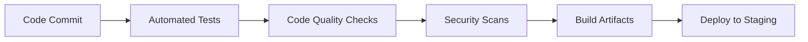
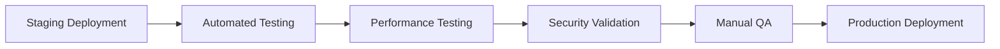

# Deployment Architecture

The InteliFeed Hub platform follows a modern cloud-native deployment architecture designed for scalability, reliability, and maintainability. This document outlines the deployment strategy, infrastructure components, and operational procedures.

## Deployment Environments

### Development Environment
- **Purpose**: Feature development and testing
- **Infrastructure**: Local development machines and cloud development environments
- **Data**: Synthetic test data
- **Access**: Development team only
- **Deployment Frequency**: Continuous deployment on every commit

### Staging Environment
- **Purpose**: Pre-production testing and validation
- **Infrastructure**: Cloud-based staging environment mirroring production
- **Data**: Anonymized production data subset
- **Access**: QA team, product managers, select stakeholders
- **Deployment Frequency**: Daily deployments

### Production Environment
- **Purpose**: Live customer-facing application
- **Infrastructure**: Highly available cloud infrastructure
- **Data**: Real customer data
- **Access**: All authorized users
- **Deployment Frequency**: Controlled releases with rollback capability

## Infrastructure Components

### Frontend Infrastructure

#### Web Application
- **Hosting**: Supabase Static Hosting or Vercel/Netlify
- **CDN**: Global content delivery network
- **SSL/TLS**: Automatic certificate management
- **Custom Domains**: Tenant-specific subdomains and custom domains

#### Mobile Applications
- **iOS**: App Store distribution
- **Android**: Google Play Store distribution
- **Updates**: Over-the-air (OTA) updates via Capacitor Live Updates

### Backend Infrastructure

#### Supabase Services
- **Database**: PostgreSQL with auto-scaling
- **Authentication**: Supabase Auth with social providers
- **Storage**: Supabase Storage with CDN integration
- **Functions**: Supabase Edge Functions for serverless compute
- **Realtime**: WebSocket-based real-time data streaming

#### Third-Party Services
- **Payment Processing**: Stripe API integration
- **Email Service**: Transactional email provider (SendGrid/SES)
- **Analytics**: Custom analytics engine
- **Error Monitoring**: Sentry integration

### Network Architecture

#### Load Balancing
- **Global Load Balancer**: Distributes traffic across regions
- **Regional Load Balancer**: Distributes traffic within regions
- **Health Checks**: Continuous monitoring of service health
- **Failover**: Automatic failover to healthy instances

#### Content Delivery
- **Edge Network**: Global CDN for static assets
- **Caching Strategy**: Multi-tier caching (browser, CDN, server)
- **Compression**: Automatic asset compression and optimization

#### Security
- **DDoS Protection**: Network-level DDoS protection
- **Web Application Firewall (WAF)**: Protection against common web attacks
- **Bot Management**: Detection and mitigation of malicious bots

## Deployment Pipeline

### Continuous Integration

### Continuous Deployment

### Deployment Process

1. **Code Commit**
   - Developers commit code to feature branches
   - Pull requests trigger CI pipeline

2. **Automated Testing**
   - Unit tests execution
   - Integration tests
   - End-to-end tests
   - Security scans

3. **Code Quality Checks**
   - Linting and formatting
   - Static analysis
   - Dependency vulnerability scanning

4. **Build Process**
   - Artifact generation
   - Container image building (if applicable)
   - Asset optimization

5. **Staging Deployment**
   - Automated deployment to staging
   - Smoke tests execution
   - Performance baseline comparison

6. **Manual QA**
   - User acceptance testing
   - Cross-browser testing
   - Mobile device testing

7. **Production Deployment**
   - Blue-green deployment strategy
   - Canary release for new features
   - Automated rollback on failure

## Database Deployment

### Schema Migrations
- **Version Control**: Database migrations stored in version control
- **Automated Application**: Migrations applied during deployment
- **Rollback Capability**: Reversible migration scripts
- **Validation**: Pre-deployment schema validation

### Data Migration
- **Backup Before Migration**: Automated backups before schema changes
- **Incremental Updates**: Support for large dataset migrations
- **Validation**: Post-migration data integrity checks
- **Rollback**: Data restoration procedures

### Scaling
- **Vertical Scaling**: CPU and memory allocation adjustments
- **Horizontal Scaling**: Read replica creation
- **Auto-scaling**: Automatic resource adjustment based on load
- **Partitioning**: Data partitioning for large tables

## Monitoring and Observability

### Health Checks
- **Service Health**: Continuous monitoring of critical services
- **Database Health**: Connection pool monitoring and query performance
- **API Health**: Response time and error rate monitoring
- **Frontend Health**: Client-side error tracking

### Performance Monitoring
- **Application Performance**: Response times and throughput
- **Database Performance**: Query performance and indexing
- **Network Performance**: Latency and bandwidth utilization
- **User Experience**: Core Web Vitals and interaction metrics

### Logging
- **Structured Logging**: Consistent log format across services
- **Centralized Logging**: Unified log aggregation
- **Log Retention**: Policy-based log retention and archiving
- **Log Analysis**: Automated log analysis for anomalies

### Alerting
- **Threshold-based Alerts**: CPU, memory, and error rate thresholds
- **Anomaly Detection**: Machine learning-based anomaly detection
- **Incident Management**: Integration with incident management systems
- **Notification Channels**: Email, SMS, and chat notifications

## Backup and Disaster Recovery

### Data Backup
- **Frequency**: Daily full backups, hourly incremental backups
- **Storage**: Geographically distributed backup storage
- **Encryption**: Encrypted backup data at rest
- **Validation**: Regular backup restoration testing

### Disaster Recovery
- **Recovery Time Objective (RTO)**: < 4 hours for critical systems
- **Recovery Point Objective (RPO)**: < 1 hour for critical data
- **Failover Procedures**: Automated failover to backup regions
- **Drills**: Quarterly disaster recovery drills

### Business Continuity
- **Multi-region Deployment**: Active-active deployment across regions
- **Data Replication**: Real-time data replication
- **Service Redundancy**: Redundant service instances
- **Communication Plan**: Stakeholder communication during incidents

## Scaling Strategy

### Horizontal Scaling
- **Auto-scaling Groups**: Dynamic instance provisioning
- **Load Distribution**: Even load distribution across instances
- **Stateless Services**: Stateless application design for easy scaling
- **Database Scaling**: Read replicas and sharding strategies

### Vertical Scaling
- **Resource Allocation**: Dynamic CPU and memory allocation
- **Performance Monitoring**: Continuous performance monitoring
- **Capacity Planning**: Predictive capacity planning
- **Cost Optimization**: Right-sizing of resources

### Database Scaling
- **Connection Pooling**: Efficient database connection management
- **Query Optimization**: Continuous query performance optimization
- **Indexing Strategy**: Adaptive indexing based on query patterns
- **Caching**: Multi-level caching strategy

## Environment Management

### Configuration Management
- **Environment Variables**: Secure environment variable management
- **Secrets Management**: Encrypted secrets storage
- **Configuration as Code**: Infrastructure and configuration as code
- **Environment Parity**: Consistent environments across stages

### Tenant Isolation
- **Database Isolation**: Row-level security for data isolation
- **Resource Quotas**: Tenant-specific resource quotas
- **Performance Isolation**: Resource isolation to prevent noisy neighbors
- **Security Isolation**: Tenant-specific security policies

### Release Management
- **Feature Flags**: Gradual feature rollout using feature flags
- **A/B Testing**: Controlled experimentation framework
- **Rollback Procedures**: Automated rollback on deployment failure
- **Change Management**: Formal change management process

## Security Deployment

### Secure Deployment
- **Zero Trust Architecture**: Verify all connections and requests
- **Immutable Infrastructure**: Immutable deployment artifacts
- **Security Scanning**: Continuous security scanning of deployed artifacts
- **Compliance Validation**: Automated compliance checks

### Access Control
- **Role-Based Access**: Role-based access to deployment systems
- **Audit Trails**: Comprehensive audit logging of deployment activities
- **Multi-Factor Authentication**: MFA for deployment system access
- **Least Privilege**: Minimal permissions for deployment processes

## Cost Management

### Resource Optimization
- **Right-sizing**: Optimal resource allocation for workloads
- **Spot Instances**: Use of spot instances for non-critical workloads
- **Reserved Instances**: Reserved capacity for predictable workloads
- **Auto-scaling**: Dynamic resource allocation based on demand

### Cost Monitoring
- **Budget Alerts**: Automated alerts for budget overruns
- **Cost Allocation**: Tenant-specific cost allocation
- **Usage Analytics**: Detailed usage and cost analytics
- **Optimization Recommendations**: Automated cost optimization recommendations

## Compliance and Governance

### Deployment Controls
- **Approval Workflows**: Multi-stage approval workflows for production deployments
- **Change Management**: Formal change management process
- **Compliance Checks**: Automated compliance validation
- **Audit Readiness**: Continuous audit trail maintenance

### Documentation
- **Deployment Procedures**: Detailed deployment procedures documentation
- **Runbooks**: Operational runbooks for common scenarios
- **Architecture Documentation**: Up-to-date architecture documentation
- **Incident Reports**: Post-incident analysis and documentation

## Monitoring Dashboard

### Key Metrics
- **System Availability**: Overall system uptime
- **Response Time**: Average API response time
- **Error Rate**: Application error rate
- **User Satisfaction**: User experience metrics

### Service Level Objectives (SLOs)
- **Availability**: 99.9% monthly uptime
- **Latency**: 95% of requests < 500ms
- **Error Rate**: < 0.1% error rate
- **Deployment Frequency**: Multiple deployments per day

### Alerting Thresholds
- **Critical Alerts**: Immediate notification and response
- **Warning Alerts**: Notification within 15 minutes
- **Info Alerts**: Daily summary reports
- **Custom Alerts**: Tenant-specific alerting rules