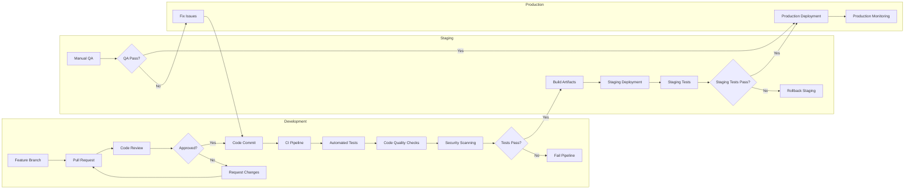

# InteliFeed Hub - Deployment Pipeline

This diagram shows the deployment pipeline for the InteliFeed Hub platform, illustrating the flow from code commit to production deployment with quality gates at each stage.