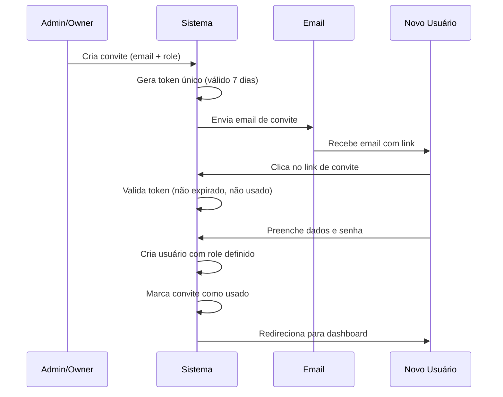
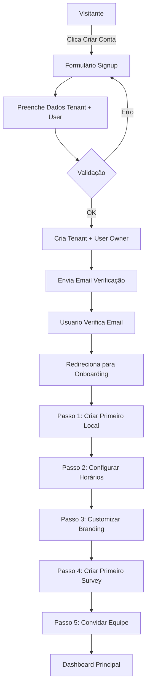
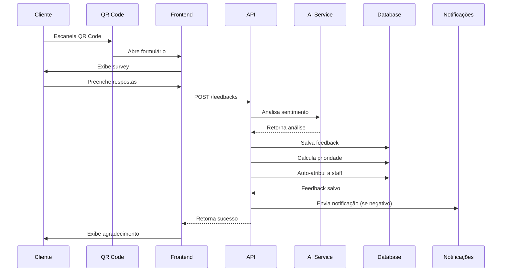
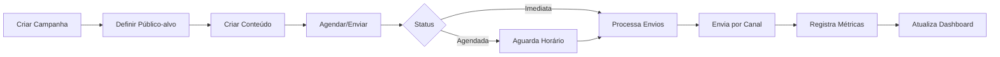

# InteliFeed Hub - Guia de Produção Completo

> **Sistema:** Plataforma SaaS Multi-tenant para Gestão de Feedback de Restaurantes  
> **Versão:** 1.0  
> **Última Atualização:** Outubro 2025

---

## 📋 ÍNDICE RÁPIDO

1. [Visão Geral do Negócio](#1-visão-geral-do-negócio)
2. [Arquitetura Multi-Tenant](#2-arquitetura-multi-tenant)
3. [Sistema de Cadastros](#3-sistema-de-cadastros)
4. [Perfis e Permissões](#4-perfis-e-permissões)
5. [Modelo de Dados](#5-modelo-de-dados)
6. [Regras de Negócio](#6-regras-de-negócio)
7. [Fluxos de Trabalho](#7-fluxos-de-trabalho)
8. [APIs e Integrações](#8-apis-e-integrações)
9. [Segurança](#9-segurança)
10. [Checklist de Produção](#10-checklist-de-produção)

---

## 1. VISÃO GERAL DO NEGÓCIO

### 1.1 Proposta de Valor

**InteliFeed Hub** é uma plataforma mobile-first para gestão de feedback de restaurantes com 4 pilares principais:

1. **AI-First Insights**: Análise automática de sentimentos e previsões em tempo real
2. **Omnichannel**: Comunicação unificada (Email, SMS, WhatsApp, Push, In-App)
3. **Event-Driven**: Engajamento gamificado através de eventos interativos
4. **Zero-Code**: Interface visual para criação de campanhas e surveys

### 1.2 Personas e Casos de Uso

| Persona | Responsabilidades | Casos de Uso Principais |
|---------|-------------------|------------------------|
| **Owner (Dono)** | Gestão estratégica completa | Configurar planos, visualizar KPIs, gerenciar billing |
| **Admin** | Gestão operacional | Adicionar locais, convidar usuários, configurar campanhas |
| **Manager (Gerente)** | Gestão de locais específicos | Analisar feedbacks, responder clientes, criar eventos |
| **Staff (Funcionário)** | Visualização operacional | Ver feedbacks do seu turno, responder dúvidas simples |
| **Viewer (Analista)** | Análise de dados | Acessar dashboards, exportar relatórios |

### 1.3 Modelo de Monetização

```
┌─────────────────────────────────────────────────────────┐
│  PLANO         │  VALOR      │  LOCAIS    │  FEEDBACKS  │
├─────────────────────────────────────────────────────────┤
│  Starter       │  R$ 97/mês  │  1         │  500/mês    │
│  Professional  │  R$ 297/mês │  5         │  2.500/mês  │
│  Enterprise    │  R$ 597/mês │  Ilimitado │  Ilimitado  │
│  Enterprise+   │  Custom     │  Ilimitado │  Ilimitado  │
└─────────────────────────────────────────────────────────┘
```

**Enterprise+ inclui:**
- Infraestrutura dedicada
- Desenvolvimento customizado
- SLA garantido
- Suporte prioritário 24/7

---

## 2. ARQUITETURA MULTI-TENANT

### 2.1 Modelo de Isolamento

**Estratégia:** Shared Schema com Row Level Security (RLS)

```
┌──────────────────────────────────────────────┐
│           DATABASE (PostgreSQL)              │
│                                              │
│  ┌─────────────────────────────────────┐    │
│  │  Tenant A (tenant_id = uuid_a)      │    │
│  │  - Users                            │    │
│  │  - Locations                        │    │
│  │  - Feedbacks                        │    │
│  └─────────────────────────────────────┘    │
│                                              │
│  ┌─────────────────────────────────────┐    │
│  │  Tenant B (tenant_id = uuid_b)      │    │
│  │  - Users                            │    │
│  │  - Locations                        │    │
│  │  - Feedbacks                        │    │
│  └─────────────────────────────────────┘    │
│                                              │
│  RLS Policies garantem isolamento total     │
└──────────────────────────────────────────────┘
```

### 2.2 Hierarquia de Dados

```
Tenant (Organização)
├── Users (Usuários)
│   └── Permissions (Permissões)
├── Locations (Restaurantes/Lojas)
│   ├── Business Hours (Horários)
│   ├── Managers (Gerentes)
│   └── Feedbacks (Avaliações)
│       ├── Responses (Respostas)
│       ├── Sentiment Analysis (Análise)
│       └── Assignments (Atribuições)
├── Campaigns (Campanhas)
│   ├── Target Audience (Público-alvo)
│   ├── Content (Conteúdo)
│   └── Metrics (Métricas)
├── Events (Eventos Gamificados)
│   ├── Triggers (Gatilhos)
│   ├── Rewards (Recompensas)
│   └── Participants (Participantes)
└── Customer Segments (Segmentos)
    ├── Criteria (Critérios)
    └── Members (Membros)
```

### 2.3 Políticas RLS Críticas

```sql
-- Exemplo: Isolamento de Users
CREATE POLICY "users_tenant_isolation" ON users
  FOR ALL USING (
    tenant_id = auth.jwt() ->> 'tenant_id'
  );

-- Exemplo: Isolamento de Feedbacks via Location
CREATE POLICY "feedbacks_tenant_isolation" ON feedbacks
  FOR ALL USING (
    location_id IN (
      SELECT id FROM locations 
      WHERE tenant_id = auth.jwt() ->> 'tenant_id'
    )
  );
```

### 2.4 Limites por Plano

| Recurso | Starter | Professional | Enterprise |
|---------|---------|--------------|------------|
| Locais | 1 | 5 | ∞ |
| Feedbacks/mês | 500 | 2.500 | ∞ |
| Usuários | 5 | 25 | ∞ |
| Campanhas/mês | 10 | 50 | ∞ |
| Eventos ativos | 3 | 15 | ∞ |
| API calls/hora | 1.000 | 10.000 | Custom |
| Armazenamento | 1GB | 10GB | Custom |

---

## 3. SISTEMA DE CADASTROS

### 3.1 Cadastro de Organização (Tenant)

**Campos Obrigatórios:**
```typescript
interface TenantRegistration {
  // Identificação
  name: string;              // Nome da empresa
  subdomain: string;         // Subdomínio único (ex: acme)
  
  // Contato
  email: string;             // Email principal
  phone?: string;            // Telefone (opcional)
  
  // Endereço (obrigatório para billing)
  address: {
    street: string;
    number: string;
    complement?: string;
    city: string;
    state: string;
    zipCode: string;
    country: string;
  };
  
  // Plano
  plan_id: 'starter' | 'professional' | 'enterprise' | 'enterprise_plus';
  
  // Branding (opcional na criação)
  branding?: {
    logo_url?: string;
    primary_color?: string;
    secondary_color?: string;
  };
}
```

**Validações:**
- `subdomain`: Apenas letras minúsculas, números e hífens. Mínimo 3, máximo 30 caracteres
- `subdomain`: Deve ser único no sistema
- `email`: Formato válido e único
- `name`: Mínimo 2 caracteres
- `zipCode`: Formato válido conforme país

**Campos Automáticos:**
```typescript
{
  id: UUID,                    // Gerado automaticamente
  created_at: TIMESTAMP,       // Data de criação
  updated_at: TIMESTAMP,       // Data de atualização
  subscription_status: 'trialing', // Status inicial
  trial_ends_at: TIMESTAMP,    // 14 dias após criação
}
```

### 3.2 Cadastro de Usuário

**Campos Obrigatórios:**
```typescript
interface UserRegistration {
  // Autenticação
  email: string;             // Único no sistema
  password: string;          // Mínimo 12 caracteres
  
  // Perfil
  full_name: string;
  role: 'owner' | 'admin' | 'manager' | 'staff' | 'viewer';
  
  // Associação
  tenant_id: UUID;           // Organização vinculada
  
  // Opcionais
  phone?: string;
  avatar_url?: string;
  language?: string;         // Default: 'pt-BR'
  timezone?: string;         // Default: 'America/Sao_Paulo'
}
```

**Validações:**
- `password`: 
  - Mínimo 12 caracteres
  - Pelo menos 1 maiúscula
  - Pelo menos 1 minúscula
  - Pelo menos 1 número
  - Pelo menos 1 caractere especial
- `email`: Único no sistema
- `role`: Deve ser um dos valores do enum
- `full_name`: Mínimo 2 caracteres

**Campos Automáticos:**
```typescript
{
  id: UUID,
  created_at: TIMESTAMP,
  last_login_at: TIMESTAMP,
  is_active: true,
  email_verified: false,     // Requer verificação
  permissions: JSON,         // Baseado no role
}
```

### 3.3 Cadastro de Local (Restaurante)

**Campos Obrigatórios:**
```typescript
interface LocationRegistration {
  tenant_id: UUID;           // Organização proprietária
  name: string;              // Nome do local
  
  // Endereço
  address: {
    street: string;
    number: string;
    complement?: string;
    neighborhood: string;
    city: string;
    state: string;
    zipCode: string;
    country: string;
    latitude?: number;
    longitude?: number;
  };
  
  // Gerenciamento
  manager_id?: UUID;         // Gerente responsável
  
  // Horários de Funcionamento
  business_hours: {
    monday?: { open: string; close: string; closed?: boolean; };
    tuesday?: { open: string; close: string; closed?: boolean; };
    wednesday?: { open: string; close: string; closed?: boolean; };
    thursday?: { open: string; close: string; closed?: boolean; };
    friday?: { open: string; close: string; closed?: boolean; };
    saturday?: { open: string; close: string; closed?: boolean; };
    sunday?: { open: string; close: string; closed?: boolean; };
  };
  
  // Configurações de Feedback
  feedback_settings?: {
    enabled: boolean;
    auto_reply: boolean;
    require_moderation: boolean;
    min_nps_for_public: number;
  };
}
```

**Validações:**
- Tenant deve ter capacidade no plano (verificar limite de locais)
- `manager_id` deve referenciar usuário válido do tenant com role >= 'manager'
- `business_hours`: Formato HH:MM (ex: "09:00", "18:30")

### 3.4 Cadastro de Feedback

**Campos Obrigatórios:**
```typescript
interface FeedbackSubmission {
  location_id: UUID;
  
  // Dados do Cliente (opcional para anônimos)
  customer_data?: {
    name?: string;
    email?: string;
    phone?: string;
    customer_id?: string;     // Se cliente cadastrado
  };
  
  // Respostas do Survey
  responses: {
    question_id: string;
    question_text: string;
    answer: string | number | string[];
    question_type: 'text' | 'rating' | 'nps' | 'multiple_choice' | 'checkbox';
  }[];
  
  // NPS Score (se aplicável)
  nps_score?: number;         // 0-10
  
  // Metadata
  channel: 'qrcode' | 'email' | 'sms' | 'whatsapp' | 'webapp' | 'kiosk';
  source_url?: string;
  device_info?: JSON;
}
```

**Campos Automáticos:**
```typescript
{
  id: UUID,
  created_at: TIMESTAMP,
  
  // Análise Automática (via AI)
  sentiment: 'positive' | 'neutral' | 'negative',
  sentiment_score: number,    // -1.0 a 1.0
  keywords: string[],
  topics: string[],
  
  // Estado
  status: 'pending',          // Inicial
  assigned_to: null,
  reviewed_at: null,
  resolved_at: null,
}
```

### 3.5 Cadastro de Campanha

**Campos Obrigatórios:**
```typescript
interface CampaignCreation {
  tenant_id: UUID;
  
  // Identificação
  name: string;
  description?: string;
  
  // Tipo e Canal
  type: 'email' | 'sms' | 'whatsapp' | 'push' | 'in_app';
  
  // Conteúdo
  content: {
    subject?: string;         // Para email
    body: string;
    template_id?: UUID;
    personalization?: JSON;
  };
  
  // Público-alvo
  target_audience: {
    segment_ids?: UUID[];
    filters?: {
      nps_range?: { min: number; max: number; };
      last_visit?: { days: number; operator: 'gt' | 'lt' | 'eq'; };
      location_ids?: UUID[];
      customer_tags?: string[];
    };
    estimated_reach?: number;
  };
  
  // Agendamento
  schedule?: {
    type: 'immediate' | 'scheduled' | 'recurring';
    send_at?: TIMESTAMP;
    timezone?: string;
    recurrence?: {
      frequency: 'daily' | 'weekly' | 'monthly';
      interval: number;
      ends_at?: TIMESTAMP;
    };
  };
}
```

**Validações:**
- Verificar limite de campanhas/mês do plano
- `content.body`: Não pode estar vazio
- `schedule.send_at`: Deve ser data futura
- `target_audience`: Deve ter pelo menos um critério

### 3.6 Cadastro de Evento Gamificado

**Campos Obrigatórios:**
```typescript
interface EventCreation {
  tenant_id: UUID;
  
  // Identificação
  name: string;
  description: string;
  
  // Tipo
  type: 'engagement_boost' | 'recovery_campaign' | 
        'lifecycle_celebration' | 'flash_campaign' | 
        'feedback_challenge';
  
  // Configuração
  config: {
    // Triggers (gatilhos)
    triggers: {
      type: 'feedback_submitted' | 'nps_threshold' | 
            'visit_count' | 'time_based';
      conditions: JSON;
    }[];
    
    // Recompensas
    rewards: {
      type: 'points' | 'badge' | 'discount' | 'free_item';
      value: number | string;
      description: string;
    }[];
    
    // Regras
    rules: {
      max_participants?: number;
      min_participation?: number;
      duration_days?: number;
      location_specific?: boolean;
    };
  };
  
  // Datas
  starts_at: TIMESTAMP;
  ends_at: TIMESTAMP;
}
```

---

## 4. PERFIS E PERMISSÕES

### 4.1 Hierarquia de Roles

```
Owner (Dono)
  ↓ Herda todas as permissões +
Admin (Administrador)
  ↓ Herda todas as permissões +
Manager (Gerente)
  ↓ Herda todas as permissões +
Staff (Funcionário)
  ↓ Herda todas as permissões +
Viewer (Visualizador)
```

### 4.2 Matriz Completa de Permissões

| Permissão | Owner | Admin | Manager | Staff | Viewer |
|-----------|-------|-------|---------|-------|--------|
| **TENANT** |
| view_tenant_settings | ✅ | ✅ | ❌ | ❌ | ❌ |
| update_tenant_settings | ✅ | ✅ | ❌ | ❌ | ❌ |
| manage_billing | ✅ | ❌ | ❌ | ❌ | ❌ |
| view_audit_logs | ✅ | ✅ | ❌ | ❌ | ❌ |
| **USERS** |
| view_users | ✅ | ✅ | ✅ | ❌ | ❌ |
| create_users | ✅ | ✅ | ❌ | ❌ | ❌ |
| update_users | ✅ | ✅ | ❌ | ❌ | ❌ |
| delete_users | ✅ | ✅ | ❌ | ❌ | ❌ |
| invite_users | ✅ | ✅ | ❌ | ❌ | ❌ |
| **LOCATIONS** |
| view_locations | ✅ | ✅ | ✅ | ✅ | ✅ |
| create_locations | ✅ | ✅ | ✅ | ❌ | ❌ |
| update_locations | ✅ | ✅ | ✅ | ❌ | ❌ |
| delete_locations | ✅ | ✅ | ❌ | ❌ | ❌ |
| **FEEDBACKS** |
| view_feedbacks | ✅ | ✅ | ✅ | ✅ | ✅ |
| respond_feedbacks | ✅ | ✅ | ✅ | ✅ | ❌ |
| assign_feedbacks | ✅ | ✅ | ✅ | ❌ | ❌ |
| delete_feedbacks | ✅ | ✅ | ❌ | ❌ | ❌ |
| export_feedbacks | ✅ | ✅ | ✅ | ❌ | ✅ |
| **CAMPAIGNS** |
| view_campaigns | ✅ | ✅ | ✅ | ❌ | ❌ |
| create_campaigns | ✅ | ✅ | ✅ | ❌ | ❌ |
| update_campaigns | ✅ | ✅ | ✅ | ❌ | ❌ |
| delete_campaigns | ✅ | ✅ | ❌ | ❌ | ❌ |
| send_campaigns | ✅ | ✅ | ✅ | ❌ | ❌ |
| **EVENTS** |
| view_events | ✅ | ✅ | ✅ | ❌ | ❌ |
| create_events | ✅ | ✅ | ✅ | ❌ | ❌ |
| update_events | ✅ | ✅ | ✅ | ❌ | ❌ |
| delete_events | ✅ | ✅ | ❌ | ❌ | ❌ |
| manage_rewards | ✅ | ✅ | ✅ | ❌ | ❌ |
| **ANALYTICS** |
| view_basic_analytics | ✅ | ✅ | ✅ | ✅ | ✅ |
| view_advanced_analytics | ✅ | ✅ | ✅ | ❌ | ✅ |
| export_reports | ✅ | ✅ | ✅ | ❌ | ✅ |
| view_financial_metrics | ✅ | ❌ | ❌ | ❌ | ❌ |

### 4.3 Regras Especiais de Permissão

**Manager Específico de Local:**
```typescript
// Manager pode ver apenas feedbacks dos locais que gerencia
if (user.role === 'manager' && user.managed_locations) {
  feedbacks = feedbacks.filter(f => 
    user.managed_locations.includes(f.location_id)
  );
}
```

**Staff com Atribuições:**
```typescript
// Staff vê todos os feedbacks, mas só pode responder os atribuídos a ele
if (user.role === 'staff') {
  canRespond = feedback.assigned_to === user.id;
}
```

**Viewer com Restrição de Dados Sensíveis:**
```typescript
// Viewer não vê dados pessoais dos clientes
if (user.role === 'viewer') {
  feedback.customer_data = maskPersonalData(feedback.customer_data);
}
```

### 4.4 Fluxo de Convite de Usuários



**Tabela de Convites:**
```typescript
interface Invitation {
  id: UUID;
  tenant_id: UUID;
  email: string;
  role: UserRole;
  invited_by: UUID;           // Quem convidou
  token: string;              // Hash único
  expires_at: TIMESTAMP;      // 7 dias
  used_at?: TIMESTAMP;
  created_at: TIMESTAMP;
}
```

---

## 5. MODELO DE DADOS

### 5.1 Entidades Core e Relacionamentos

```sql
-- TENANTS (Organizações)
CREATE TABLE tenants (
  id UUID PRIMARY KEY DEFAULT gen_random_uuid(),
  name VARCHAR(255) NOT NULL,
  subdomain VARCHAR(50) UNIQUE NOT NULL 
    CHECK (subdomain ~ '^[a-z0-9][a-z0-9-]*[a-z0-9]$'),
  email VARCHAR(255) UNIQUE NOT NULL,
  phone VARCHAR(20),
  
  -- Endereço
  address JSONB NOT NULL,
  
  -- Plano e Billing
  plan_id VARCHAR(50) NOT NULL 
    DEFAULT 'starter'
    CHECK (plan_id IN ('starter', 'professional', 'enterprise', 'enterprise_plus')),
  subscription_status VARCHAR(20) NOT NULL 
    DEFAULT 'trialing'
    CHECK (subscription_status IN ('active', 'trialing', 'past_due', 'canceled', 'unpaid')),
  trial_ends_at TIMESTAMP,
  subscription_ends_at TIMESTAMP,
  
  -- Branding
  branding JSONB DEFAULT '{}',
  
  -- Configurações
  settings JSONB DEFAULT '{}',
  
  -- Limites e Uso
  usage_limits JSONB NOT NULL,
  current_usage JSONB DEFAULT '{}',
  
  -- Auditoria
  created_at TIMESTAMP DEFAULT NOW(),
  updated_at TIMESTAMP DEFAULT NOW(),
  deleted_at TIMESTAMP
);

CREATE INDEX idx_tenants_subdomain ON tenants(subdomain);
CREATE INDEX idx_tenants_plan ON tenants(plan_id);

-- USERS
CREATE TABLE users (
  id UUID PRIMARY KEY DEFAULT gen_random_uuid(),
  tenant_id UUID NOT NULL REFERENCES tenants(id) ON DELETE CASCADE,
  
  -- Autenticação (gerenciada pelo Supabase Auth)
  auth_id UUID UNIQUE NOT NULL,  -- Referência ao auth.users
  email VARCHAR(255) UNIQUE NOT NULL,
  
  -- Perfil
  full_name VARCHAR(255) NOT NULL,
  avatar_url VARCHAR(500),
  phone VARCHAR(20),
  
  -- Permissões
  role VARCHAR(20) NOT NULL 
    DEFAULT 'viewer'
    CHECK (role IN ('owner', 'admin', 'manager', 'staff', 'viewer')),
  permissions JSONB DEFAULT '[]',
  
  -- Gerenciamento de Locais (para managers)
  managed_locations UUID[] DEFAULT ARRAY[]::UUID[],
  
  -- Preferências
  language VARCHAR(10) DEFAULT 'pt-BR',
  timezone VARCHAR(50) DEFAULT 'America/Sao_Paulo',
  notification_preferences JSONB DEFAULT '{}',
  
  -- Estado
  is_active BOOLEAN DEFAULT TRUE,
  email_verified BOOLEAN DEFAULT FALSE,
  last_login_at TIMESTAMP,
  
  -- Auditoria
  created_at TIMESTAMP DEFAULT NOW(),
  updated_at TIMESTAMP DEFAULT NOW(),
  deleted_at TIMESTAMP
);

CREATE INDEX idx_users_tenant ON users(tenant_id);
CREATE INDEX idx_users_email ON users(email);
CREATE INDEX idx_users_role ON users(tenant_id, role);

-- LOCATIONS (Restaurantes)
CREATE TABLE locations (
  id UUID PRIMARY KEY DEFAULT gen_random_uuid(),
  tenant_id UUID NOT NULL REFERENCES tenants(id) ON DELETE CASCADE,
  
  -- Identificação
  name VARCHAR(255) NOT NULL,
  slug VARCHAR(255) NOT NULL,
  
  -- Endereço
  address JSONB NOT NULL,
  coordinates POINT,  -- PostGIS para geolocalização
  
  -- Gerenciamento
  manager_id UUID REFERENCES users(id) ON DELETE SET NULL,
  
  -- Horários
  business_hours JSONB NOT NULL DEFAULT '{}',
  
  -- Configurações de Feedback
  feedback_settings JSONB DEFAULT '{
    "enabled": true,
    "auto_reply": false,
    "require_moderation": false,
    "min_nps_for_public": 7
  }',
  
  -- Estado
  is_active BOOLEAN DEFAULT TRUE,
  
  -- Auditoria
  created_at TIMESTAMP DEFAULT NOW(),
  updated_at TIMESTAMP DEFAULT NOW(),
  deleted_at TIMESTAMP,
  
  CONSTRAINT unique_location_slug_per_tenant UNIQUE (tenant_id, slug)
);

CREATE INDEX idx_locations_tenant ON locations(tenant_id);
CREATE INDEX idx_locations_manager ON locations(manager_id);
CREATE INDEX idx_locations_coordinates ON locations USING GIST(coordinates);

-- FEEDBACKS
CREATE TABLE feedbacks (
  id UUID PRIMARY KEY DEFAULT gen_random_uuid(),
  location_id UUID NOT NULL REFERENCES locations(id) ON DELETE CASCADE,
  
  -- Dados do Cliente
  customer_data JSONB,
  customer_id UUID,  -- Se cliente cadastrado
  
  -- Respostas
  responses JSONB NOT NULL,
  
  -- Scores
  nps_score INTEGER CHECK (nps_score >= 0 AND nps_score <= 10),
  overall_rating DECIMAL(3,2) CHECK (overall_rating >= 0 AND overall_rating <= 5),
  
  -- Análise AI
  sentiment VARCHAR(20) 
    CHECK (sentiment IN ('positive', 'neutral', 'negative')),
  sentiment_score DECIMAL(3,2) CHECK (sentiment_score >= -1 AND sentiment_score <= 1),
  keywords TEXT[],
  topics TEXT[],
  ai_summary TEXT,
  
  -- Metadados
  channel VARCHAR(20) NOT NULL 
    CHECK (channel IN ('qrcode', 'email', 'sms', 'whatsapp', 'webapp', 'kiosk')),
  source_url VARCHAR(500),
  device_info JSONB,
  
  -- Estado e Gestão
  status VARCHAR(20) DEFAULT 'pending'
    CHECK (status IN ('pending', 'reviewed', 'resolved', 'archived')),
  assigned_to UUID REFERENCES users(id) ON DELETE SET NULL,
  priority VARCHAR(20) DEFAULT 'normal'
    CHECK (priority IN ('low', 'normal', 'high', 'urgent')),
  
  -- Timestamps
  reviewed_at TIMESTAMP,
  resolved_at TIMESTAMP,
  created_at TIMESTAMP DEFAULT NOW(),
  updated_at TIMESTAMP DEFAULT NOW()
);

CREATE INDEX idx_feedbacks_location ON feedbacks(location_id);
CREATE INDEX idx_feedbacks_created_at ON feedbacks(location_id, created_at DESC);
CREATE INDEX idx_feedbacks_status ON feedbacks(location_id, status);
CREATE INDEX idx_feedbacks_sentiment ON feedbacks(sentiment);
CREATE INDEX idx_feedbacks_nps ON feedbacks(nps_score);
CREATE INDEX idx_feedbacks_assigned ON feedbacks(assigned_to);

-- CAMPAIGNS
CREATE TABLE campaigns (
  id UUID PRIMARY KEY DEFAULT gen_random_uuid(),
  tenant_id UUID NOT NULL REFERENCES tenants(id) ON DELETE CASCADE,
  
  -- Identificação
  name VARCHAR(255) NOT NULL,
  description TEXT,
  
  -- Tipo e Canal
  type VARCHAR(20) NOT NULL 
    CHECK (type IN ('email', 'sms', 'whatsapp', 'push', 'in_app')),
  
  -- Conteúdo
  content JSONB NOT NULL,
  template_id UUID,
  
  -- Público-alvo
  target_audience JSONB NOT NULL,
  estimated_reach INTEGER,
  
  -- Agendamento
  schedule JSONB,
  send_at TIMESTAMP,
  timezone VARCHAR(50) DEFAULT 'America/Sao_Paulo',
  
  -- Estado
  status VARCHAR(20) DEFAULT 'draft'
    CHECK (status IN ('draft', 'scheduled', 'active', 'paused', 'completed', 'failed')),
  
  -- Métricas
  metrics JSONB DEFAULT '{
    "sent": 0,
    "delivered": 0,
    "opened": 0,
    "clicked": 0,
    "converted": 0,
    "bounced": 0,
    "unsubscribed": 0
  }',
  
  -- Auditoria
  created_by UUID REFERENCES users(id) ON DELETE SET NULL,
  created_at TIMESTAMP DEFAULT NOW(),
  updated_at TIMESTAMP DEFAULT NOW(),
  sent_at TIMESTAMP,
  completed_at TIMESTAMP
);

CREATE INDEX idx_campaigns_tenant ON campaigns(tenant_id);
CREATE INDEX idx_campaigns_status ON campaigns(status);
CREATE INDEX idx_campaigns_send_at ON campaigns(send_at) WHERE status = 'scheduled';

-- EVENTS (Eventos Gamificados)
CREATE TABLE events (
  id UUID PRIMARY KEY DEFAULT gen_random_uuid(),
  tenant_id UUID NOT NULL REFERENCES tenants(id) ON DELETE CASCADE,
  
  -- Identificação
  name VARCHAR(255) NOT NULL,
  description TEXT NOT NULL,
  
  -- Tipo
  type VARCHAR(50) NOT NULL 
    CHECK (type IN ('engagement_boost', 'recovery_campaign', 'lifecycle_celebration', 
                    'flash_campaign', 'feedback_challenge')),
  
  -- Configuração
  config JSONB NOT NULL,
  
  -- Datas
  starts_at TIMESTAMP NOT NULL,
  ends_at TIMESTAMP NOT NULL,
  
  -- Estado
  status VARCHAR(20) DEFAULT 'draft'
    CHECK (status IN ('draft', 'published', 'ongoing', 'completed', 'cancelled')),
  
  -- Métricas
  metrics JSONB DEFAULT '{
    "participants": 0,
    "completions": 0,
    "rewards_claimed": 0,
    "engagement_rate": 0
  }',
  
  -- Auditoria
  created_by UUID REFERENCES users(id) ON DELETE SET NULL,
  created_at TIMESTAMP DEFAULT NOW(),
  updated_at TIMESTAMP DEFAULT NOW(),
  
  CONSTRAINT valid_event_dates CHECK (ends_at > starts_at)
);

CREATE INDEX idx_events_tenant ON events(tenant_id);
CREATE INDEX idx_events_status ON events(status);
CREATE INDEX idx_events_dates ON events(starts_at, ends_at);

-- CUSTOMER_SEGMENTS
CREATE TABLE customer_segments (
  id UUID PRIMARY KEY DEFAULT gen_random_uuid(),
  tenant_id UUID NOT NULL REFERENCES tenants(id) ON DELETE CASCADE,
  
  -- Identificação
  name VARCHAR(255) NOT NULL,
  description TEXT,
  
  -- Critérios
  criteria JSONB NOT NULL,
  
  -- Membros (cache)
  member_count INTEGER DEFAULT 0,
  last_calculated_at TIMESTAMP,
  
  -- Estado
  is_active BOOLEAN DEFAULT TRUE,
  
  -- Auditoria
  created_by UUID REFERENCES users(id) ON DELETE SET NULL,
  created_at TIMESTAMP DEFAULT NOW(),
  updated_at TIMESTAMP DEFAULT NOW()
);

CREATE INDEX idx_segments_tenant ON customer_segments(tenant_id);

-- INVITATIONS
CREATE TABLE invitations (
  id UUID PRIMARY KEY DEFAULT gen_random_uuid(),
  tenant_id UUID NOT NULL REFERENCES tenants(id) ON DELETE CASCADE,
  
  -- Convite
  email VARCHAR(255) NOT NULL,
  role VARCHAR(20) NOT NULL 
    CHECK (role IN ('admin', 'manager', 'staff', 'viewer')),
  
  -- Token
  token VARCHAR(255) UNIQUE NOT NULL,
  
  -- Estado
  expires_at TIMESTAMP NOT NULL,
  used_at TIMESTAMP,
  accepted_by UUID REFERENCES users(id) ON DELETE SET NULL,
  
  -- Auditoria
  invited_by UUID NOT NULL REFERENCES users(id) ON DELETE CASCADE,
  created_at TIMESTAMP DEFAULT NOW(),
  
  CONSTRAINT unique_pending_invitation UNIQUE (tenant_id, email) 
    WHERE used_at IS NULL
);

CREATE INDEX idx_invitations_token ON invitations(token) WHERE used_at IS NULL;
CREATE INDEX idx_invitations_email ON invitations(email) WHERE used_at IS NULL;

-- AUDIT_LOGS
CREATE TABLE audit_logs (
  id UUID PRIMARY KEY DEFAULT gen_random_uuid(),
  tenant_id UUID NOT NULL REFERENCES tenants(id) ON DELETE CASCADE,
  
  -- Ação
  user_id UUID REFERENCES users(id) ON DELETE SET NULL,
  action VARCHAR(100) NOT NULL,
  resource_type VARCHAR(50) NOT NULL,
  resource_id UUID,
  
  -- Detalhes
  details JSONB,
  changes JSONB,  -- Before/After para updates
  
  -- Contexto
  ip_address INET,
  user_agent TEXT,
  
  -- Timestamp
  created_at TIMESTAMP DEFAULT NOW()
);

CREATE INDEX idx_audit_logs_tenant ON audit_logs(tenant_id, created_at DESC);
CREATE INDEX idx_audit_logs_user ON audit_logs(user_id, created_at DESC);
CREATE INDEX idx_audit_logs_resource ON audit_logs(resource_type, resource_id);

-- API_KEYS
CREATE TABLE api_keys (
  id UUID PRIMARY KEY DEFAULT gen_random_uuid(),
  tenant_id UUID NOT NULL REFERENCES tenants(id) ON DELETE CASCADE,
  
  -- Chave
  name VARCHAR(255) NOT NULL,
  key_hash VARCHAR(255) UNIQUE NOT NULL,
  key_prefix VARCHAR(20) NOT NULL,  -- Primeiros caracteres para identificação
  
  -- Permissões
  permissions JSONB NOT NULL DEFAULT '[]',
  scopes TEXT[] DEFAULT ARRAY[]::TEXT[],
  
  -- Limites
  rate_limit INTEGER DEFAULT 1000,  -- Requests por hora
  
  -- Estado
  is_active BOOLEAN DEFAULT TRUE,
  expires_at TIMESTAMP,
  last_used_at TIMESTAMP,
  
  -- Auditoria
  created_by UUID REFERENCES users(id) ON DELETE SET NULL,
  created_at TIMESTAMP DEFAULT NOW(),
  revoked_at TIMESTAMP,
  revoked_by UUID REFERENCES users(id) ON DELETE SET NULL
);

CREATE INDEX idx_api_keys_tenant ON api_keys(tenant_id);
CREATE INDEX idx_api_keys_hash ON api_keys(key_hash) WHERE is_active = TRUE;
```

### 5.2 Materialized Views para Performance

```sql
-- DAILY_FEEDBACK_SUMMARY
CREATE MATERIALIZED VIEW daily_feedback_summary AS
SELECT 
  l.tenant_id,
  f.location_id,
  DATE(f.created_at) as feedback_date,
  COUNT(*) as total_feedbacks,
  AVG(f.nps_score) as avg_nps,
  AVG(f.overall_rating) as avg_rating,
  COUNT(*) FILTER (WHERE f.sentiment = 'positive') as positive_count,
  COUNT(*) FILTER (WHERE f.sentiment = 'neutral') as neutral_count,
  COUNT(*) FILTER (WHERE f.sentiment = 'negative') as negative_count,
  COUNT(*) FILTER (WHERE f.nps_score >= 9) as promoters,
  COUNT(*) FILTER (WHERE f.nps_score >= 7 AND f.nps_score <= 8) as passives,
  COUNT(*) FILTER (WHERE f.nps_score <= 6) as detractors
FROM feedbacks f
JOIN locations l ON f.location_id = l.id
WHERE f.deleted_at IS NULL
GROUP BY l.tenant_id, f.location_id, DATE(f.created_at);

CREATE UNIQUE INDEX idx_daily_summary_unique 
  ON daily_feedback_summary(tenant_id, location_id, feedback_date);

-- Refresh automático (configurar no PostgreSQL)
-- REFRESH MATERIALIZED VIEW CONCURRENTLY daily_feedback_summary;

-- TENANT_STATISTICS
CREATE MATERIALIZED VIEW tenant_statistics AS
SELECT 
  t.id as tenant_id,
  COUNT(DISTINCT u.id) as total_users,
  COUNT(DISTINCT l.id) as total_locations,
  COUNT(DISTINCT f.id) as total_feedbacks,
  COUNT(DISTINCT f.id) FILTER (
    WHERE f.created_at >= DATE_TRUNC('month', CURRENT_DATE)
  ) as feedbacks_this_month,
  AVG(f.nps_score) as avg_nps_score,
  AVG(f.overall_rating) as avg_overall_rating
FROM tenants t
LEFT JOIN users u ON t.id = u.tenant_id AND u.deleted_at IS NULL
LEFT JOIN locations l ON t.id = l.tenant_id AND l.deleted_at IS NULL
LEFT JOIN feedbacks f ON l.id = f.location_id
WHERE t.deleted_at IS NULL
GROUP BY t.id;

CREATE UNIQUE INDEX idx_tenant_stats_unique ON tenant_statistics(tenant_id);
```

### 5.3 Enumerações Completas

```typescript
// User Roles
enum UserRole {
  OWNER = 'owner',
  ADMIN = 'admin',
  MANAGER = 'manager',
  STAFF = 'staff',
  VIEWER = 'viewer'
}

// Subscription Status
enum SubscriptionStatus {
  ACTIVE = 'active',
  TRIALING = 'trialing',
  PAST_DUE = 'past_due',
  CANCELED = 'canceled',
  UNPAID = 'unpaid'
}

// Plan Types
enum PlanType {
  STARTER = 'starter',
  PROFESSIONAL = 'professional',
  ENTERPRISE = 'enterprise',
  ENTERPRISE_PLUS = 'enterprise_plus'
}

// Campaign Types
enum CampaignType {
  EMAIL = 'email',
  SMS = 'sms',
  WHATSAPP = 'whatsapp',
  PUSH = 'push',
  IN_APP = 'in_app'
}

// Campaign Status
enum CampaignStatus {
  DRAFT = 'draft',
  SCHEDULED = 'scheduled',
  ACTIVE = 'active',
  PAUSED = 'paused',
  COMPLETED = 'completed',
  FAILED = 'failed'
}

// Event Types
enum EventType {
  ENGAGEMENT_BOOST = 'engagement_boost',
  RECOVERY_CAMPAIGN = 'recovery_campaign',
  LIFECYCLE_CELEBRATION = 'lifecycle_celebration',
  FLASH_CAMPAIGN = 'flash_campaign',
  FEEDBACK_CHALLENGE = 'feedback_challenge'
}

// Event Status
enum EventStatus {
  DRAFT = 'draft',
  PUBLISHED = 'published',
  ONGOING = 'ongoing',
  COMPLETED = 'completed',
  CANCELLED = 'cancelled'
}

// Feedback Status
enum FeedbackStatus {
  PENDING = 'pending',
  REVIEWED = 'reviewed',
  RESOLVED = 'resolved',
  ARCHIVED = 'archived'
}

// Feedback Sentiment
enum FeedbackSentiment {
  POSITIVE = 'positive',
  NEUTRAL = 'neutral',
  NEGATIVE = 'negative'
}

// Feedback Channel
enum FeedbackChannel {
  QRCODE = 'qrcode',
  EMAIL = 'email',
  SMS = 'sms',
  WHATSAPP = 'whatsapp',
  WEBAPP = 'webapp',
  KIOSK = 'kiosk'
}

// Priority Levels
enum Priority {
  LOW = 'low',
  NORMAL = 'normal',
  HIGH = 'high',
  URGENT = 'urgent'
}
```

---

## 6. REGRAS DE NEGÓCIO

### 6.1 Validações Críticas

#### Validação de Limites por Plano

```typescript
async function validatePlanLimits(tenantId: string, resource: string): Promise<boolean> {
  const tenant = await getTenant(tenantId);
  const usage = tenant.current_usage;
  const limits = PLAN_LIMITS[tenant.plan_id];
  
  switch(resource) {
    case 'location':
      return usage.locations < limits.max_locations;
    
    case 'feedback':
      const currentMonth = new Date().getMonth();
      return usage.feedbacks_this_month < limits.max_feedbacks_per_month;
    
    case 'campaign':
      return usage.campaigns_this_month < limits.max_campaigns_per_month;
    
    case 'user':
      return usage.total_users < limits.max_users;
    
    default:
      return false;
  }
}

const PLAN_LIMITS = {
  starter: {
    max_locations: 1,
    max_feedbacks_per_month: 500,
    max_campaigns_per_month: 10,
    max_users: 5,
    max_events: 3
  },
  professional: {
    max_locations: 5,
    max_feedbacks_per_month: 2500,
    max_campaigns_per_month: 50,
    max_users: 25,
    max_events: 15
  },
  enterprise: {
    max_locations: Infinity,
    max_feedbacks_per_month: Infinity,
    max_campaigns_per_month: Infinity,
    max_users: Infinity,
    max_events: Infinity
  }
};
```

#### Validação de Transições de Status

```typescript
// Feedback Status Transitions
const FEEDBACK_STATUS_TRANSITIONS = {
  pending: ['reviewed', 'archived'],
  reviewed: ['resolved', 'pending', 'archived'],
  resolved: ['archived'],
  archived: [] // Final state
};

function canTransitionFeedbackStatus(
  currentStatus: FeedbackStatus,
  newStatus: FeedbackStatus
): boolean {
  const allowedTransitions = FEEDBACK_STATUS_TRANSITIONS[currentStatus];
  return allowedTransitions.includes(newStatus);
}

// Campaign Status Transitions
const CAMPAIGN_STATUS_TRANSITIONS = {
  draft: ['scheduled', 'active'],
  scheduled: ['active', 'draft', 'paused'],
  active: ['paused', 'completed'],
  paused: ['active', 'completed'],
  completed: [], // Final state
  failed: ['draft'] // Can restart
};

// Event Status Transitions
const EVENT_STATUS_TRANSITIONS = {
  draft: ['published'],
  published: ['ongoing'],
  ongoing: ['completed', 'cancelled'],
  completed: [], // Final state
  cancelled: [] // Final state
};
```

### 6.2 Regras de Cálculo

#### Cálculo de NPS (Net Promoter Score)

```typescript
function calculateNPS(feedbacks: Feedback[]): number {
  if (feedbacks.length === 0) return 0;
  
  const scores = feedbacks.map(f => f.nps_score).filter(s => s !== null);
  
  const promoters = scores.filter(s => s >= 9).length;
  const detractors = scores.filter(s => s <= 6).length;
  const total = scores.length;
  
  return Math.round(((promoters - detractors) / total) * 100);
}
```

#### Análise de Sentimento (Regra de Classificação)

```typescript
function classifySentiment(sentimentScore: number): FeedbackSentiment {
  if (sentimentScore >= 0.3) return FeedbackSentiment.POSITIVE;
  if (sentimentScore <= -0.3) return FeedbackSentiment.NEGATIVE;
  return FeedbackSentiment.NEUTRAL;
}

// Cálculo de Score de Sentimento (via AI)
async function analyzeSentiment(feedbackText: string): Promise<{
  score: number;
  sentiment: FeedbackSentiment;
  keywords: string[];
  topics: string[];
}> {
  // Integração com serviço de AI (OpenAI, Anthropic, etc)
  const aiResponse = await aiService.analyze(feedbackText);
  
  return {
    score: aiResponse.sentimentScore, // -1.0 a 1.0
    sentiment: classifySentiment(aiResponse.sentimentScore),
    keywords: aiResponse.keywords,
    topics: aiResponse.topics
  };
}
```

#### Priorização Automática de Feedbacks

```typescript
function calculateFeedbackPriority(feedback: Feedback): Priority {
  let score = 0;
  
  // NPS muito baixo
  if (feedback.nps_score !== null && feedback.nps_score <= 3) {
    score += 3;
  }
  
  // Sentimento negativo
  if (feedback.sentiment === 'negative') {
    score += 2;
  }
  
  // Palavras-chave críticas
  const criticalKeywords = ['péssimo', 'horrível', 'sujo', 'demorado', 'frio'];
  const hasCriticalKeyword = feedback.keywords?.some(k => 
    criticalKeywords.includes(k.toLowerCase())
  );
  if (hasCriticalKeyword) {
    score += 2;
  }
  
  // Rating muito baixo
  if (feedback.overall_rating !== null && feedback.overall_rating <= 2) {
    score += 1;
  }
  
  // Classificação
  if (score >= 5) return Priority.URGENT;
  if (score >= 3) return Priority.HIGH;
  if (score >= 1) return Priority.NORMAL;
  return Priority.LOW;
}
```

### 6.3 Regras de Domínio

#### Soft Delete Pattern

```typescript
// Ao invés de deletar, marca como deleted
async function softDelete(table: string, id: string): Promise<void> {
  await db.from(table)
    .update({ 
      deleted_at: new Date(),
      updated_at: new Date()
    })
    .eq('id', id);
}

// Queries sempre filtram deleted_at
async function getActiveRecords(table: string, tenantId: string) {
  return await db.from(table)
    .select('*')
    .eq('tenant_id', tenantId)
    .is('deleted_at', null);
}
```

#### Cascade de Deleção

```typescript
// Ao deletar Tenant, marca tudo como deleted
async function deleteTenant(tenantId: string): Promise<void> {
  const now = new Date();
  
  // Cascade manual para soft delete
  await Promise.all([
    db.from('users').update({ deleted_at: now }).eq('tenant_id', tenantId),
    db.from('locations').update({ deleted_at: now }).eq('tenant_id', tenantId),
    db.from('campaigns').update({ deleted_at: now }).eq('tenant_id', tenantId),
    db.from('events').update({ deleted_at: now }).eq('tenant_id', tenantId),
  ]);
  
  // Finalmente, deleta o tenant
  await db.from('tenants').update({ deleted_at: now }).eq('id', tenantId);
}
```

#### Atribuição Automática de Feedbacks

```typescript
async function autoAssignFeedback(feedback: Feedback): Promise<void> {
  // Regra 1: Manager do local
  const location = await getLocation(feedback.location_id);
  if (location.manager_id) {
    feedback.assigned_to = location.manager_id;
    return;
  }
  
  // Regra 2: Staff com menos atribuições ativas
  const staffMembers = await getStaffByLocation(feedback.location_id);
  const assignments = await getActiveAssignmentsByStaff(staffMembers);
  
  const leastBusyStaff = staffMembers.reduce((prev, curr) => 
    assignments[curr.id] < assignments[prev.id] ? curr : prev
  );
  
  feedback.assigned_to = leastBusyStaff.id;
}
```

---

## 7. FLUXOS DE TRABALHO

### 7.1 Onboarding Completo



#### Código do Fluxo de Onboarding

```typescript
async function completeOnboarding(tenantId: string, data: OnboardingData) {
  // Step 1: Criar primeiro local
  const location = await createLocation({
    tenant_id: tenantId,
    name: data.locationName,
    address: data.address,
    business_hours: data.businessHours
  });
  
  // Step 2: Configurar branding
  await updateTenant(tenantId, {
    branding: {
      logo_url: data.logoUrl,
      primary_color: data.primaryColor,
      secondary_color: data.secondaryColor
    }
  });
  
  // Step 3: Criar survey padrão
  const surveyTemplate = getDefaultSurveyTemplate();
  await createSurveyForLocation(location.id, surveyTemplate);
  
  // Step 4: Enviar convites (opcional)
  if (data.invitations && data.invitations.length > 0) {
    await Promise.all(
      data.invitations.map(inv => 
        createInvitation(tenantId, inv.email, inv.role)
      )
    );
  }
  
  // Step 5: Marcar onboarding como completo
  await updateTenant(tenantId, {
    settings: {
      onboarding_completed: true,
      onboarding_completed_at: new Date()
    }
  });
}
```

### 7.2 Fluxo de Feedback Completo



#### Código do Fluxo de Feedback

```typescript
async function submitFeedback(data: FeedbackSubmission): Promise<Feedback> {
  // 1. Validar localização
  const location = await getLocation(data.location_id);
  if (!location || !location.is_active) {
    throw new Error('Location not found or inactive');
  }
  
  // 2. Verificar limites do plano
  const tenant = await getTenantByLocation(location.id);
  const canSubmit = await validatePlanLimits(tenant.id, 'feedback');
  if (!canSubmit) {
    throw new Error('Feedback limit reached for this month');
  }
  
  // 3. Análise de sentimento via AI
  const mainFeedbackText = data.responses
    .filter(r => r.question_type === 'text')
    .map(r => r.answer)
    .join(' ');
  
  const sentimentAnalysis = await analyzeSentiment(mainFeedbackText);
  
  // 4. Criar feedback
  const feedback = await createFeedback({
    ...data,
    sentiment: sentimentAnalysis.sentiment,
    sentiment_score: sentimentAnalysis.score,
    keywords: sentimentAnalysis.keywords,
    topics: sentimentAnalysis.topics,
    status: 'pending'
  });
  
  // 5. Calcular prioridade
  const priority = calculateFeedbackPriority(feedback);
  await updateFeedback(feedback.id, { priority });
  
  // 6. Auto-atribuir
  await autoAssignFeedback(feedback);
  
  // 7. Notificar se crítico
  if (priority === 'urgent' || priority === 'high') {
    await notifyTeam(feedback);
  }
  
  // 8. Atualizar estatísticas
  await incrementTenantUsage(tenant.id, 'feedbacks_this_month');
  
  // 9. Disparar eventos (gamificação)
  await triggerEvents(tenant.id, 'feedback_submitted', feedback);
  
  return feedback;
}
```

### 7.3 Fluxo de Campanha



#### Código do Fluxo de Campanha

```typescript
async function sendCampaign(campaignId: string): Promise<void> {
  const campaign = await getCampaign(campaignId);
  
  // 1. Validar status
  if (campaign.status !== 'scheduled' && campaign.status !== 'draft') {
    throw new Error('Campaign cannot be sent in current status');
  }
  
  // 2. Calcular público-alvo
  const recipients = await calculateTargetAudience(campaign.target_audience);
  
  // 3. Atualizar estimativa
  await updateCampaign(campaignId, {
    estimated_reach: recipients.length,
    status: 'active'
  });
  
  // 4. Enviar por lotes
  const batchSize = 100;
  for (let i = 0; i < recipients.length; i += batchSize) {
    const batch = recipients.slice(i, i + batchSize);
    
    await Promise.all(
      batch.map(recipient => 
        sendMessage(campaign, recipient)
      )
    );
    
    // Atualizar métricas
    await updateCampaignMetrics(campaignId, {
      sent: i + batch.length
    });
  }
  
  // 5. Marcar como completa
  await updateCampaign(campaignId, {
    status: 'completed',
    sent_at: new Date(),
    completed_at: new Date()
  });
}

async function sendMessage(
  campaign: Campaign, 
  recipient: Recipient
): Promise<void> {
  try {
    switch (campaign.type) {
      case 'email':
        await emailService.send({
          to: recipient.email,
          subject: campaign.content.subject,
          body: personalizeContent(campaign.content.body, recipient)
        });
        break;
      
      case 'sms':
        await smsService.send({
          to: recipient.phone,
          message: personalizeContent(campaign.content.body, recipient)
        });
        break;
      
      case 'whatsapp':
        await whatsappService.send({
          to: recipient.phone,
          message: personalizeContent(campaign.content.body, recipient)
        });
        break;
      
      case 'push':
        await pushService.send({
          to: recipient.device_token,
          title: campaign.content.subject,
          body: personalizeContent(campaign.content.body, recipient)
        });
        break;
    }
    
    // Registrar envio bem-sucedido
    await logCampaignDelivery(campaign.id, recipient.id, 'delivered');
    
  } catch (error) {
    // Registrar falha
    await logCampaignDelivery(campaign.id, recipient.id, 'failed');
  }
}
```

---

## 8. APIS E INTEGRAÇÕES

### 8.1 Autenticação e Headers

```typescript
// Headers obrigatórios
const headers = {
  'Authorization': `Bearer ${accessToken}`,
  'Content-Type': 'application/json',
  'X-Tenant-ID': tenantId  // Opcional, extraído do JWT
};

// Estrutura do JWT
interface JWTPayload {
  sub: string;              // user_id
  email: string;
  role: UserRole;
  tenant_id: string;
  permissions: string[];
  exp: number;
  iat: number;
}
```

### 8.2 Endpoints Principais

#### Authentication

```typescript
// POST /auth/signup
POST /api/auth/signup
Body: {
  email: string;
  password: string;
  full_name: string;
  tenant_name: string;
  subdomain: string;
}
Response: {
  user: User;
  tenant: Tenant;
  session: Session;
}

// POST /auth/login
POST /api/auth/login
Body: {
  email: string;
  password: string;
}
Response: {
  access_token: string;
  refresh_token: string;
  user: User;
}

// POST /auth/refresh
POST /api/auth/refresh
Body: {
  refresh_token: string;
}
Response: {
  access_token: string;
  refresh_token: string;
}
```

#### Tenants

```typescript
// GET /tenants/me
GET /api/tenants/me
Response: Tenant

// PATCH /tenants/me
PATCH /api/tenants/me
Body: Partial<Tenant>
Response: Tenant

// GET /tenants/me/usage
GET /api/tenants/me/usage
Response: {
  current_usage: TenantUsage;
  limits: PlanLimits;
  percentage_used: Record<string, number>;
}
```

#### Users

```typescript
// GET /users
GET /api/users?page=1&limit=20&role=manager
Response: {
  data: User[];
  pagination: Pagination;
}

// POST /users
POST /api/users
Body: UserRegistration
Response: User

// GET /users/:id
GET /api/users/:id
Response: User

// PATCH /users/:id
PATCH /api/users/:id
Body: Partial<User>
Response: User

// DELETE /users/:id
DELETE /api/users/:id
Response: { success: boolean }

// POST /users/invite
POST /api/users/invite
Body: {
  email: string;
  role: UserRole;
}
Response: Invitation
```

#### Locations

```typescript
// GET /locations
GET /api/locations?page=1&limit=20&is_active=true
Response: {
  data: Location[];
  pagination: Pagination;
}

// POST /locations
POST /api/locations
Body: LocationRegistration
Response: Location

// GET /locations/:id
GET /api/locations/:id
Response: Location

// PATCH /locations/:id
PATCH /api/locations/:id
Body: Partial<Location>
Response: Location

// DELETE /locations/:id
DELETE /api/locations/:id
Response: { success: boolean }

// GET /locations/:id/stats
GET /api/locations/:id/stats?period=30d
Response: {
  total_feedbacks: number;
  avg_nps: number;
  avg_rating: number;
  sentiment_distribution: Record<string, number>;
  trend: 'up' | 'down' | 'stable';
}
```

#### Feedbacks

```typescript
// GET /feedbacks
GET /api/feedbacks?location_id=xxx&status=pending&page=1&limit=20&sort=-created_at
Response: {
  data: Feedback[];
  pagination: Pagination;
  filters_applied: Record<string, any>;
}

// POST /feedbacks (Público - sem auth)
POST /api/public/feedbacks
Body: FeedbackSubmission
Response: {
  id: string;
  message: string;
  points_earned?: number;  // Se gamificação ativa
}

// GET /feedbacks/:id
GET /api/feedbacks/:id
Response: Feedback

// PATCH /feedbacks/:id
PATCH /api/feedbacks/:id
Body: {
  status?: FeedbackStatus;
  assigned_to?: string;
  priority?: Priority;
  notes?: string;
}
Response: Feedback

// POST /feedbacks/:id/respond
POST /api/feedbacks/:id/respond
Body: {
  message: string;
  channel?: 'email' | 'sms' | 'whatsapp';
  mark_as_resolved?: boolean;
}
Response: {
  success: boolean;
  response_sent: boolean;
}

// DELETE /feedbacks/:id
DELETE /api/feedbacks/:id
Response: { success: boolean }

// POST /feedbacks/export
POST /api/feedbacks/export
Body: {
  location_ids?: string[];
  date_range: { start: string; end: string };
  format: 'csv' | 'xlsx' | 'json';
  filters?: Record<string, any>;
}
Response: {
  download_url: string;
  expires_at: string;
}
```

#### Campaigns

```typescript
// GET /campaigns
GET /api/campaigns?status=active&type=email&page=1
Response: {
  data: Campaign[];
  pagination: Pagination;
}

// POST /campaigns
POST /api/campaigns
Body: CampaignCreation
Response: Campaign

// GET /campaigns/:id
GET /api/campaigns/:id
Response: Campaign

// PATCH /campaigns/:id
PATCH /api/campaigns/:id
Body: Partial<Campaign>
Response: Campaign

// POST /campaigns/:id/send
POST /api/campaigns/:id/send
Body: {
  send_immediately?: boolean;
  test_recipients?: string[];  // Para envio de teste
}
Response: {
  success: boolean;
  estimated_reach: number;
  scheduled_for?: string;
}

// POST /campaigns/:id/pause
POST /api/campaigns/:id/pause
Response: Campaign

// POST /campaigns/:id/resume
POST /api/campaigns/:id/resume
Response: Campaign

// GET /campaigns/:id/metrics
GET /api/campaigns/:id/metrics
Response: {
  sent: number;
  delivered: number;
  opened: number;
  clicked: number;
  converted: number;
  bounced: number;
  unsubscribed: number;
  delivery_rate: number;
  open_rate: number;
  click_rate: number;
  conversion_rate: number;
}
```

#### Events

```typescript
// GET /events
GET /api/events?status=ongoing&page=1
Response: {
  data: Event[];
  pagination: Pagination;
}

// POST /events
POST /api/events
Body: EventCreation
Response: Event

// GET /events/:id
GET /api/events/:id
Response: Event

// PATCH /events/:id
PATCH /api/events/:id
Body: Partial<Event>
Response: Event

// POST /events/:id/publish
POST /api/events/:id/publish
Response: Event

// POST /events/:id/cancel
POST /api/events/:id/cancel
Body: {
  reason?: string;
}
Response: Event

// GET /events/:id/participants
GET /api/events/:id/participants?page=1
Response: {
  data: EventParticipant[];
  pagination: Pagination;
  total_participants: number;
  completion_rate: number;
}

// GET /events/:id/leaderboard
GET /api/events/:id/leaderboard?limit=10
Response: {
  leaders: Array<{
    customer_id: string;
    name: string;
    points: number;
    rank: number;
  }>;
}
```

#### Analytics (RPC Functions)

```typescript
// POST /rpc/get_dashboard_stats
POST /api/rpc/get_dashboard_stats
Body: {
  location_ids?: string[];
  date_range?: { start: string; end: string };
}
Response: {
  total_feedbacks: number;
  avg_nps: number;
  nps_trend: number;  // Variação percentual
  avg_rating: number;
  rating_trend: number;
  sentiment_distribution: {
    positive: number;
    neutral: number;
    negative: number;
  };
  top_keywords: Array<{ keyword: string; count: number; }>;
  feedback_by_channel: Record<string, number>;
  response_time_avg: number;  // Em horas
}

// POST /rpc/get_nps_over_time
POST /api/rpc/get_nps_over_time
Body: {
  location_ids?: string[];
  period: 'day' | 'week' | 'month';
  date_range: { start: string; end: string };
}
Response: {
  data: Array<{
    date: string;
    nps: number;
    promoters: number;
    passives: number;
    detractors: number;
    total_responses: number;
  }>;
}

// POST /rpc/get_sentiment_analysis
POST /api/rpc/get_sentiment_analysis
Body: {
  location_ids?: string[];
  date_range: { start: string; end: string };
}
Response: {
  overall_sentiment: 'positive' | 'neutral' | 'negative';
  sentiment_score: number;
  distribution: Record<string, number>;
  trending_topics: Array<{
    topic: string;
    mentions: number;
    sentiment: string;
  }>;
  word_cloud: Array<{ text: string; value: number; }>;
}

// POST /rpc/get_location_comparison
POST /api/rpc/get_location_comparison
Body: {
  location_ids: string[];
  metrics: string[];  // ['nps', 'rating', 'response_time']
  date_range: { start: string; end: string };
}
Response: {
  locations: Array<{
    location_id: string;
    location_name: string;
    metrics: Record<string, number>;
    rank: number;
  }>;
}
```

### 8.3 Realtime Subscriptions (Supabase Realtime)

```typescript
// Subscribe to new feedbacks
const feedbackSubscription = supabase
  .channel('feedbacks')
  .on(
    'postgres_changes',
    {
      event: 'INSERT',
      schema: 'public',
      table: 'feedbacks',
      filter: `location_id=eq.${locationId}`
    },
    (payload) => {
      console.log('New feedback:', payload.new);
      // Atualizar UI em tempo real
    }
  )
  .subscribe();

// Subscribe to campaign metrics updates
const campaignSubscription = supabase
  .channel('campaign_metrics')
  .on(
    'postgres_changes',
    {
      event: 'UPDATE',
      schema: 'public',
      table: 'campaigns',
      filter: `id=eq.${campaignId}`
    },
    (payload) => {
      console.log('Campaign metrics updated:', payload.new.metrics);
      // Atualizar dashboard
    }
  )
  .subscribe();

// Subscribe to event participants
const eventSubscription = supabase
  .channel('event_participants')
  .on(
    'postgres_changes',
    {
      event: '*',
      schema: 'public',
      table: 'event_participants',
      filter: `event_id=eq.${eventId}`
    },
    (payload) => {
      console.log('Event participation changed:', payload);
      // Atualizar leaderboard
    }
  )
  .subscribe();
```

### 8.4 Rate Limiting

```typescript
// Rate limits por endpoint (por tenant)
const RATE_LIMITS = {
  // Leitura
  'GET /api/*': { requests: 1000, window: '1h' },
  
  // Escrita
  'POST /api/feedbacks': { requests: 100, window: '1h' },
  'POST /api/campaigns': { requests: 50, window: '1h' },
  'POST /api/events': { requests: 20, window: '1h' },
  
  // Analytics (mais custoso)
  'POST /api/rpc/*': { requests: 100, window: '1h' },
  
  // Export (muito custoso)
  'POST /api/feedbacks/export': { requests: 10, window: '1h' },
};

// Headers de rate limit na resposta
Response Headers:
  X-RateLimit-Limit: 1000
  X-RateLimit-Remaining: 847
  X-RateLimit-Reset: 1635724800
```

### 8.5 Webhooks

```typescript
// Configuração de Webhooks (no tenant settings)
interface WebhookConfig {
  id: string;
  url: string;
  events: string[];  // ['feedback.created', 'campaign.completed', etc]
  secret: string;    // Para validar assinatura
  is_active: boolean;
}

// Eventos disponíveis
const WEBHOOK_EVENTS = [
  'feedback.created',
  'feedback.updated',
  'feedback.deleted',
  'campaign.started',
  'campaign.completed',
  'campaign.failed',
  'event.published',
  'event.completed',
  'user.invited',
  'user.joined',
  'subscription.updated',
  'subscription.cancelled',
];

// Payload do webhook
interface WebhookPayload {
  event: string;
  timestamp: string;
  tenant_id: string;
  data: any;
  signature: string;  // HMAC-SHA256
}

// Exemplo de payload
{
  "event": "feedback.created",
  "timestamp": "2025-10-24T14:30:00Z",
  "tenant_id": "uuid-tenant",
  "data": {
    "feedback": {
      "id": "uuid-feedback",
      "location_id": "uuid-location",
      "nps_score": 9,
      "sentiment": "positive",
      "created_at": "2025-10-24T14:30:00Z"
    }
  },
  "signature": "sha256=..."
}

// Validação de assinatura
function validateWebhookSignature(
  payload: string,
  signature: string,
  secret: string
): boolean {
  const expectedSignature = crypto
    .createHmac('sha256', secret)
    .update(payload)
    .digest('hex');
  
  return `sha256=${expectedSignature}` === signature;
}
```

---

## 9. SEGURANÇA

### 9.1 Políticas de Senha

```typescript
const PASSWORD_POLICY = {
  minLength: 12,
  requireUppercase: true,
  requireLowercase: true,
  requireNumbers: true,
  requireSpecialChars: true,
  preventCommonPasswords: true,
  preventPasswordReuse: 5,  // Últimas 5 senhas
  maxAge: 90,  // Dias (para enterprise)
  accountLockout: {
    maxAttempts: 5,
    lockoutDuration: 30  // Minutos
  }
};

function validatePassword(password: string): {
  valid: boolean;
  errors: string[];
} {
  const errors: string[] = [];
  
  if (password.length < PASSWORD_POLICY.minLength) {
    errors.push(`Senha deve ter no mínimo ${PASSWORD_POLICY.minLength} caracteres`);
  }
  
  if (PASSWORD_POLICY.requireUppercase && !/[A-Z]/.test(password)) {
    errors.push('Senha deve conter pelo menos uma letra maiúscula');
  }
  
  if (PASSWORD_POLICY.requireLowercase && !/[a-z]/.test(password)) {
    errors.push('Senha deve conter pelo menos uma letra minúscula');
  }
  
  if (PASSWORD_POLICY.requireNumbers && !/\d/.test(password)) {
    errors.push('Senha deve conter pelo menos um número');
  }
  
  if (PASSWORD_POLICY.requireSpecialChars && !/[!@#$%^&*(),.?":{}|<>]/.test(password)) {
    errors.push('Senha deve conter pelo menos um caractere especial');
  }
  
  // Check common passwords
  if (PASSWORD_POLICY.preventCommonPasswords && COMMON_PASSWORDS.includes(password)) {
    errors.push('Senha muito comum. Escolha uma senha mais forte');
  }
  
  return {
    valid: errors.length === 0,
    errors
  };
}
```

### 9.2 Multi-Factor Authentication (MFA)

```typescript
// Habilitar MFA
POST /api/auth/mfa/enable
Body: {
  method: 'totp' | 'sms';
}
Response: {
  secret: string;  // Para TOTP
  qr_code_url: string;  // Para TOTP
  backup_codes: string[];
}

// Verificar MFA
POST /api/auth/mfa/verify
Body: {
  code: string;
}
Response: {
  verified: boolean;
}

// Desabilitar MFA
POST /api/auth/mfa/disable
Body: {
  code: string;  // Código atual para confirmar
}
Response: {
  success: boolean;
}
```

### 9.3 Audit Logs

```typescript
// Todas as ações críticas são registradas
interface AuditLog {
  id: string;
  tenant_id: string;
  user_id: string;
  action: string;
  resource_type: string;
  resource_id: string;
  details: Record<string, any>;
  changes?: {
    before: Record<string, any>;
    after: Record<string, any>;
  };
  ip_address: string;
  user_agent: string;
  created_at: string;
}

// Ações auditadas
const AUDITED_ACTIONS = [
  'user.created',
  'user.updated',
  'user.deleted',
  'user.login',
  'user.logout',
  'user.password_changed',
  'user.mfa_enabled',
  'user.mfa_disabled',
  'location.created',
  'location.updated',
  'location.deleted',
  'feedback.deleted',
  'campaign.sent',
  'event.published',
  'tenant.settings_updated',
  'tenant.plan_changed',
  'api_key.created',
  'api_key.revoked',
];

// Query audit logs
GET /api/audit-logs?user_id=xxx&action=user.deleted&page=1&limit=50
Response: {
  data: AuditLog[];
  pagination: Pagination;
}
```

### 9.4 Data Protection (LGPD/GDPR)

```typescript
// Anonimização de dados
async function anonymizeCustomerData(customerId: string): Promise<void> {
  await db.transaction(async (trx) => {
    // Anonimizar dados pessoais
    await trx('feedbacks')
      .where({ customer_id: customerId })
      .update({
        customer_data: {
          name: 'ANONIMIZADO',
          email: `anon-${customerId}@example.com`,
          phone: null
        },
        updated_at: new Date()
      });
    
    // Registrar ação
    await createAuditLog({
      action: 'customer.anonymized',
      resource_type: 'customer',
      resource_id: customerId,
      details: { reason: 'LGPD request' }
    });
  });
}

// Exportar dados do usuário (direito à portabilidade)
POST /api/users/me/export-data
Response: {
  download_url: string;
  expires_at: string;
  format: 'json';
}

// Deletar conta (direito ao esquecimento)
DELETE /api/users/me
Body: {
  password: string;  // Confirmação
  reason?: string;
}
Response: {
  success: boolean;
  anonymization_scheduled: boolean;
  complete_deletion_date: string;  // 30 dias após
}
```

### 9.5 Criptografia

```typescript
// Dados sensíveis criptografados em repouso
interface EncryptedField {
  encrypted_data: string;  // AES-256-GCM
  encryption_key_id: string;
  iv: string;
}

// Campos criptografados
const ENCRYPTED_FIELDS = [
  'users.phone',
  'feedbacks.customer_data.email',
  'feedbacks.customer_data.phone',
  'api_keys.key_hash',
];

// TLS 1.3 obrigatório para todas as conexões
const TLS_CONFIG = {
  minVersion: 'TLSv1.3',
  ciphers: [
    'TLS_AES_256_GCM_SHA384',
    'TLS_AES_128_GCM_SHA256',
  ],
  certificateValidation: 'strict'
};
```

---

## 10. CHECKLIST DE PRODUÇÃO

### 10.1 Pré-Deploy

#### Infraestrutura
- [ ] Variáveis de ambiente configuradas
- [ ] Secrets gerenciados via Supabase Vault
- [ ] SSL/TLS certificates válidos
- [ ] DNS configurado corretamente
- [ ] CDN configurado para assets estáticos
- [ ] Backup automático habilitado
- [ ] Point-in-time recovery configurado

#### Database
- [ ] Todas as migrations aplicadas
- [ ] Indexes criados e otimizados
- [ ] RLS policies habilitadas em todas as tabelas
- [ ] Materialized views criadas
- [ ] Triggers configurados
- [ ] Particionamento de tabelas grandes (se necessário)
- [ ] Connection pooling configurado

#### Segurança
- [ ] Rate limiting habilitado
- [ ] CORS configurado corretamente
- [ ] Headers de segurança configurados
- [ ] API keys rotacionadas
- [ ] MFA habilitado para admins
- [ ] Audit logging ativo
- [ ] Firewall rules configuradas

#### Monitoramento
- [ ] APM configurado (ex: New Relic, Datadog)
- [ ] Error tracking ativo (Sentry)
- [ ] Logs centralizados
- [ ] Alertas configurados
- [ ] Dashboards criados
- [ ] Health checks implementados
- [ ] Uptime monitoring ativo

#### Performance
- [ ] Cache strategy implementada
- [ ] Image optimization ativa
- [ ] Code splitting configurado
- [ ] Lazy loading implementado
- [ ] Service worker configurado (PWA)
- [ ] Bundle size otimizado

### 10.2 Testes Críticos

#### Testes de Segurança
- [ ] Teste de isolamento multi-tenant
- [ ] Teste de RLS policies
- [ ] Teste de rate limiting
- [ ] Teste de SQL injection
- [ ] Teste de XSS
- [ ] Teste de CSRF
- [ ] Penetration testing

#### Testes de Performance
- [ ] Load testing (1000 usuários simultâneos)
- [ ] Stress testing (pico de tráfego)
- [ ] Database query performance
- [ ] API response times < 200ms (p95)
- [ ] Time to Interactive < 3s
- [ ] Largest Contentful Paint < 2.5s

#### Testes Funcionais
- [ ] Onboarding flow completo
- [ ] Criação de feedback end-to-end
- [ ] Envio de campanha
- [ ] Criação e publicação de evento
- [ ] Convite de usuários
- [ ] Upgrade/downgrade de plano
- [ ] Export de dados

### 10.3 Pós-Deploy

#### Validação
- [ ] Health check endpoints respondendo
- [ ] Login funcionando
- [ ] Criação de recursos funcionando
- [ ] Realtime subscriptions ativas
- [ ] Webhooks sendo disparados
- [ ] Emails sendo enviados
- [ ] SMS/WhatsApp funcionando

#### Monitoramento
- [ ] Verificar dashboards
- [ ] Confirmar alertas funcionando
- [ ] Validar logs sendo coletados
- [ ] Verificar métricas de performance
- [ ] Monitorar error rates

#### Comunicação
- [ ] Notificar stakeholders
- [ ] Atualizar documentação
- [ ] Publicar release notes
- [ ] Atualizar status page

### 10.4 Disaster Recovery Plan

#### Backup
```typescript
// Estratégia de backup
const BACKUP_STRATEGY = {
  // Backup completo diário
  full: {
    frequency: 'daily',
    retention: '30 days',
    time: '02:00 UTC'
  },
  
  // Backup incremental a cada 6h
  incremental: {
    frequency: '6h',
    retention: '7 days'
  },
  
  // Point-in-time recovery
  pitr: {
    enabled: true,
    retention: '7 days'
  },
  
  // Backup cross-region
  replication: {
    enabled: true,
    regions: ['us-east-1', 'eu-west-1']
  }
};
```

#### Recovery Time Objective (RTO)
- **Critical**: 1 hora
- **High**: 4 horas
- **Medium**: 24 horas
- **Low**: 72 horas

#### Recovery Point Objective (RPO)
- **Critical data**: 15 minutos
- **Important data**: 1 hora
- **Standard data**: 24 horas

#### Procedimento de Rollback
```bash
# 1. Identificar versão anterior estável
git tag --list

# 2. Rollback da aplicação
git checkout v1.2.3
npm run build
npm run deploy:production

# 3. Rollback do database (se necessário)
supabase db rollback --timestamp "2025-10-24 14:00:00"

# 4. Validar funcionamento
npm run test:smoke

# 5. Notificar equipe
./scripts/notify-rollback.sh
```

---

## 11. MÉTRICAS DE SUCESSO

### 11.1 KPIs de Negócio

```typescript
interface BusinessKPIs {
  // Revenue
  mrr: number;  // Monthly Recurring Revenue
  arr: number;  // Annual Recurring Revenue
  arpu: number; // Average Revenue Per User
  
  // Growth
  new_tenants_month: number;
  churn_rate: number;  // %
  expansion_mrr: number;  // Upgrades
  
  // Engagement
  dau: number;  // Daily Active Users
  mau: number;  // Monthly Active Users
  stickiness: number;  // DAU/MAU ratio
  
  // Product
  avg_feedbacks_per_tenant: number;
  avg_campaigns_per_tenant: number;
  avg_response_time: number;  // horas
  
  // Quality
  nps_score: number;
  customer_satisfaction: number;
  feature_adoption_rate: Record<string, number>;
}
```

### 11.2 SLAs (Service Level Agreements)

```typescript
const SERVICE_LEVEL_AGREEMENTS = {
  // Uptime
  uptime: {
    target: 99.9,  // %
    measurement: 'monthly',
    consequences: {
      '99.9': 'No penalty',
      '99.5-99.9': '10% credit',
      '99.0-99.5': '25% credit',
      '<99.0': '50% credit'
    }
  },
  
  // Performance
  api_response_time: {
    p50: 100,  // ms
    p95: 200,  // ms
    p99: 500   // ms
  },
  
  // Support
  support_response_time: {
    critical: '1 hour',
    high: '4 hours',
    medium: '24 hours',
    low: '72 hours'
  }
};
```

---

## 12. TROUBLESHOOTING COMUM

### 12.1 Problemas Frequentes

#### Feedback não está sendo salvo
```typescript
// Verificar:
1. Limites do plano não foram excedidos
2. RLS policy está correta
3. Location está ativa
4. AI service está respondendo

// Debug:
SELECT * FROM tenants WHERE id = 'xxx';
SELECT current_usage FROM tenants WHERE id = 'xxx';
```

#### Campanha não está enviando
```typescript
// Verificar:
1. Status da campanha é 'scheduled' ou 'active'
2. Público-alvo calculado > 0
3. Credenciais de email/SMS estão válidas
4. Rate limit não foi atingido

// Debug:
SELECT * FROM campaigns WHERE id = 'xxx';
SELECT metrics FROM campaigns WHERE id = 'xxx';
```

#### Usuário não consegue acessar recurso
```typescript
// Verificar:
1. Permissões do role
2. RLS policy aplicada
3. Tenant_id correto
4. Recurso não foi soft-deleted

// Debug:
SELECT role, permissions FROM users WHERE id = 'xxx';
SELECT * FROM locations WHERE tenant_id = 'xxx' AND deleted_at IS NULL;
```

---

## CONCLUSÃO

Este guia fornece uma visão completa do InteliFeed Hub para produção, cobrindo:

✅ **Arquitetura**: Multi-tenant com isolamento total via RLS  
✅ **Cadastros**: Todos os formulários e validações necessárias  
✅ **Permissões**: Sistema hierárquico com 5 roles  
✅ **Modelo de Dados**: Schema completo com relacionamentos  
✅ **Regras de Negócio**: Validações, cálculos e workflows  
✅ **APIs**: Endpoints completos com exemplos  
✅ **Segurança**: LGPD/GDPR compliance, MFA, audit logs  
✅ **Checklist**: Preparação completa para produção

**Próximos Passos:**
1. Revisar e validar cada seção com stakeholders
2. Implementar testes automatizados para regras críticas
3. Configurar ambiente de staging
4. Executar checklist de pré-deploy
5. Deploy gradual (canary deployment)