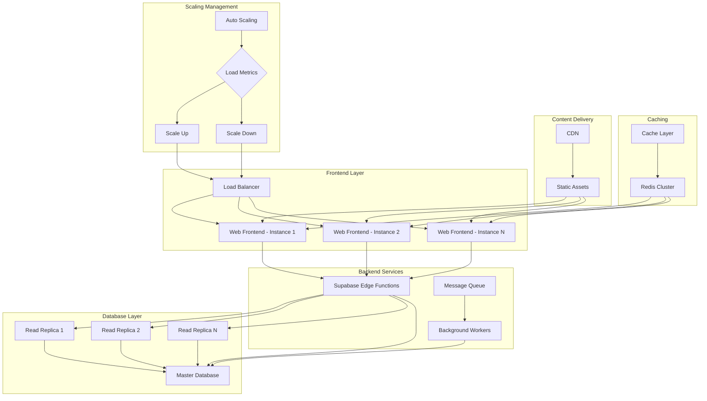

# InteliFeed Hub - Scalability Architecture Diagram

This diagram illustrates the scalability architecture of the InteliFeed Hub platform, showing how different components can scale horizontally to handle increased load.