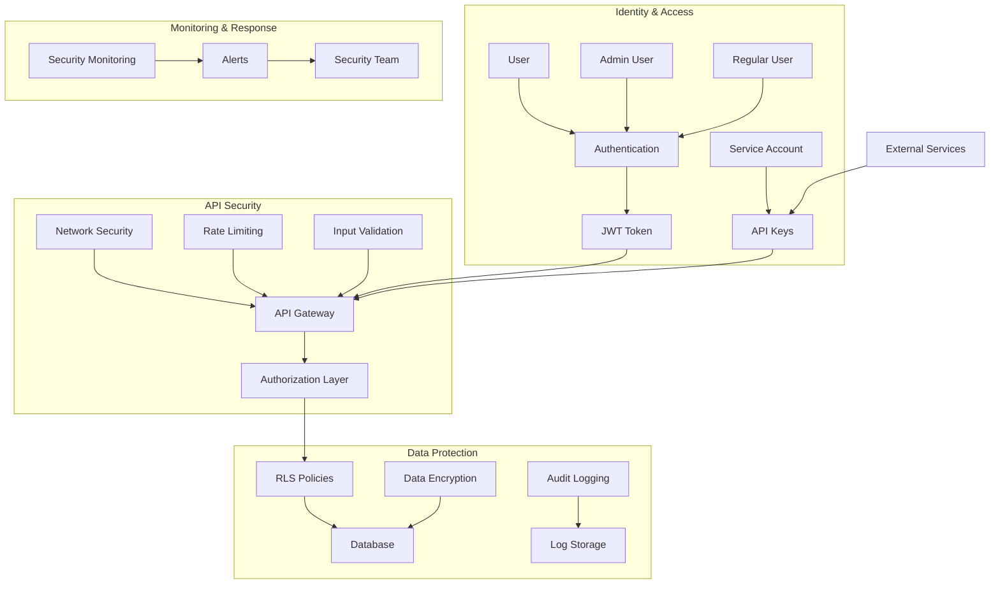

# InteliFeed Hub - Security Architecture Diagram

This diagram illustrates the security architecture of the InteliFeed Hub platform, showing the various security measures in place to protect the system and data.